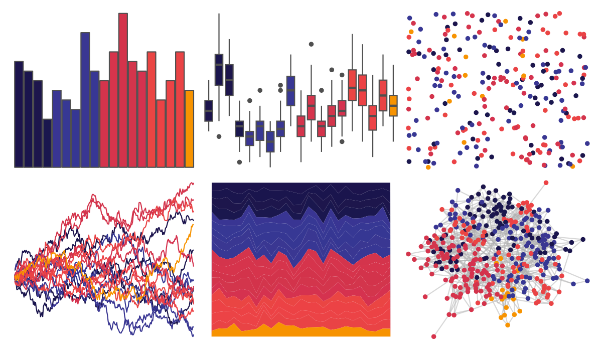

# beyonce - X99 

::: columns
::: {.column width="50%"}

**Github**

[dill/beyonce](https://github.com/dill/beyonce)
:::

::: {.column width="50%"}

**CRAN**

Not on CRAN
:::
:::

<hr> 

Use with [paletteer](https://emilhvitfeldt.github.io/paletteer/) package:

```r
library(paletteer)
paletteer_d("beyonce::X99")
```

Use raw:

```r
c("#1C144DFF", "#1A154DFF", "#1D164CFF", "#1A174EFF", "#393593FF", "#373894FF", "#363793FF", "#3A3792FF", "#383794FF", "#D4344CFF", "#D6344CFF", "#D3334BFF", "#D3354CFF", "#D5324FFF", "#EA4543FF", "#EC4245FF", "#EC4346FF", "#E94345FF", "#F79301FF")
``` 

 

<br>

# Related Palettes

<div class="list" style="display: grid; grid-template-columns: auto auto auto;"> <figure class="figure">
<a href="../../amerika/Dem_Ind_Rep3/"> </a>
</figure> <figure class="figure">
<a href="../../beyonce/X76/"> </a>
</figure> <figure class="figure">
<a href="../../peRReo/ivyqueen/"> </a>
</figure> <figure class="figure">
<a href="../../vapoRwave/newRetro/"> </a>
</figure> <figure class="figure">
<a href="../../beyonce/X83/"> </a>
</figure> <figure class="figure">
<a href="../../beyonce/X61/"> </a>
</figure> <figure class="figure">
<a href="../../peRReo/natti/"> </a>
</figure> <figure class="figure">
<a href="../../MoMAColors/Panton/"> </a>
</figure> <figure class="figure">
<a href="../../nbapalettes/suns_city/"> </a>
</figure> <figure class="figure">
<a href="../../MetBrewer/Troy/"> </a>
</figure> <figure class="figure">
<a href="../../NatParksPalettes/DeathValley/"> </a>
</figure> <figure class="figure">
<a href="../../beyonce/X14/"> </a>
</figure> 
</div>
