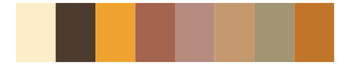

# blueycolors - chilli 

::: columns
::: {.column width="50%"}

**Github**

[ekholme/blueycolors](https://github.com/ekholme/blueycolors)
:::

::: {.column width="50%"}

**CRAN**

Not on CRAN
:::
:::

<hr> 

Use with [paletteer](https://emilhvitfeldt.github.io/paletteer/) package:

```r
library(paletteer)
paletteer_d("blueycolors::chilli")
```

Use raw:

```r
c("#FFFAD8FF", "#FFD08DFF", "#FFB070FF", "#9C5E33FF", "#46362AFF")
``` 

 

<br>

# Related Palettes

<div class="list" style="display: grid; grid-template-columns: auto auto auto;"> <figure class="figure">
<a href="../../amerika/Dem_Ind_Rep3/"> </a>
</figure> <figure class="figure">
<a href="../../colRoz/v_acanthurus/"> </a>
</figure> <figure class="figure">
<a href="../../poisonfrogs/Dsarayacuensis/"> </a>
</figure> <figure class="figure">
<a href="../../tayloRswift/fearlessTV/"> </a>
</figure> <figure class="figure">
<a href="../../tayloRswift/fearless/"> </a>
</figure> <figure class="figure">
<a href="../../PNWColors/Mushroom/"> </a>
</figure> <figure class="figure">
<a href="../../DresdenColor/sidejobs/"> </a>
</figure> <figure class="figure">
<a href="../../DresdenColor/graveperil/"> </a>
</figure> <figure class="figure">
<a href="../../fishualize/Zapteryx_brevirostris/"> </a>
</figure> <figure class="figure">
<a href="../../colRoz/flavolineata/"> </a>
</figure> <figure class="figure">
<a href="../../Redmonder/qMSOYlOr/"> </a>
</figure> <figure class="figure">
<a href="../../palettetown/kakuna/"> </a>
</figure> 
</div>
