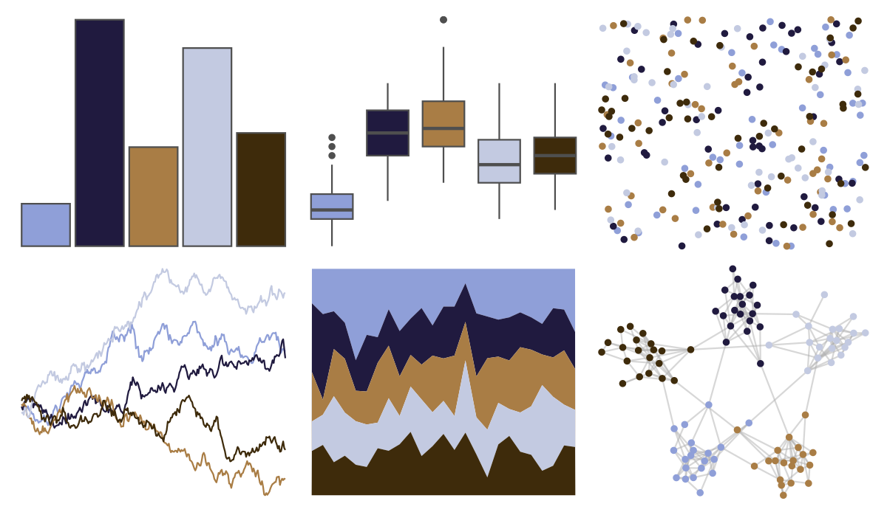

# blueycolors - socks 

::: columns
::: {.column width="50%"}

**Github**

[ekholme/blueycolors](https://github.com/ekholme/blueycolors)
:::

::: {.column width="50%"}

**CRAN**

Not on CRAN
:::
:::

<hr> 

Use with [paletteer](https://emilhvitfeldt.github.io/paletteer/) package:

```r
library(paletteer)
paletteer_d("blueycolors::socks")
```

Use raw:

```r
c("#8F9FD8FF", "#201A3FFF", "#A97D45FF", "#C3CAE1FF", "#3E2B0BFF")
``` 

 

<br>

# Related Palettes

<div class="list" style="display: grid; grid-template-columns: auto auto auto;"> <figure class="figure">
<a href="../../amerika/Dem_Ind_Rep3/"> </a>
</figure> <figure class="figure">
<a href="../../tayloRswift/SunriseBoulevard1989/"> </a>
</figure> <figure class="figure">
<a href="../../beyonce/X6/"> </a>
</figure> <figure class="figure">
<a href="../../futurevisions/jupiter/"> </a>
</figure> <figure class="figure">
<a href="../../beyonce/X2/"> </a>
</figure> <figure class="figure">
<a href="../../ghibli/SpiritedMedium/"> </a>
</figure> <figure class="figure">
<a href="../../MoMAColors/Picasso/"> </a>
</figure> <figure class="figure">
<a href="../../rockthemes/miles/"> </a>
</figure> <figure class="figure">
<a href="../../fishualize/Stegastes_nigricans/"> </a>
</figure> <figure class="figure">
<a href="../../colRoz/i_lesueurii/"> </a>
</figure> <figure class="figure">
<a href="../../colRoz/p_cincta/"> </a>
</figure> <figure class="figure">
<a href="../../colRoz/salt_lake/"> </a>
</figure> 
</div>
