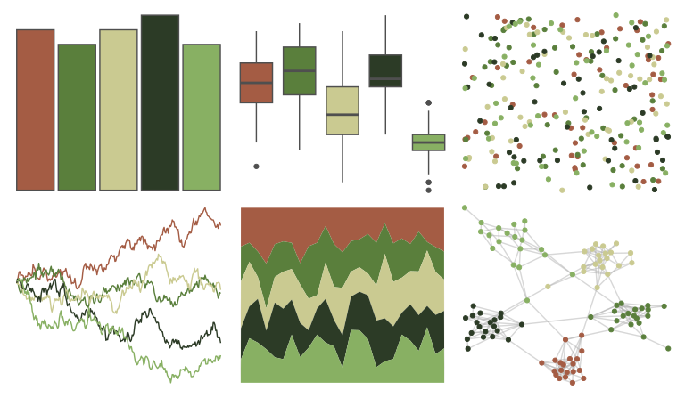

# calecopal - agriculture 

::: columns
::: {.column width="50%"}

**Github**

[an-bui/calecopal](https://github.com/an-bui/calecopal)
:::

::: {.column width="50%"}

**CRAN**

Not on CRAN
:::
:::

<hr> 

Use with [paletteer](https://emilhvitfeldt.github.io/paletteer/) package:

```r
library(paletteer)
paletteer_d("calecopal::agriculture")
```

Use raw:

```r
c("#A45C44FF", "#5A7F3CFF", "#CACA91FF", "#2C3B26FF", "#88B063FF")
``` 

 

<br>

# Related Palettes

<div class="list" style="display: grid; grid-template-columns: auto auto auto;"> <figure class="figure">
<a href="../../awtools/a_palette/"> </a>
</figure> <figure class="figure">
<a href="../../calecopal/redwood1/"> </a>
</figure> <figure class="figure">
<a href="../../ochRe/jumping_frog/"> </a>
</figure> <figure class="figure">
<a href="../../lisa/LeonardodaVinci/"> </a>
</figure> <figure class="figure">
<a href="../../yarrr/bugs/"> </a>
</figure> <figure class="figure">
<a href="../../lisa/RemediosVaro/"> </a>
</figure> <figure class="figure">
<a href="../../wesanderson/Cavalcanti1/"> </a>
</figure> <figure class="figure">
<a href="../../colRoz/p_mitchelli/"> </a>
</figure> <figure class="figure">
<a href="../../Manu/Titipounamu/"> </a>
</figure> <figure class="figure">
<a href="../../lisa/OttoDix_1/"> </a>
</figure> <figure class="figure">
<a href="../../beyonce/X39/"> </a>
</figure> <figure class="figure">
<a href="../../lisa/JohnQuidor/"> </a>
</figure> 
</div>
