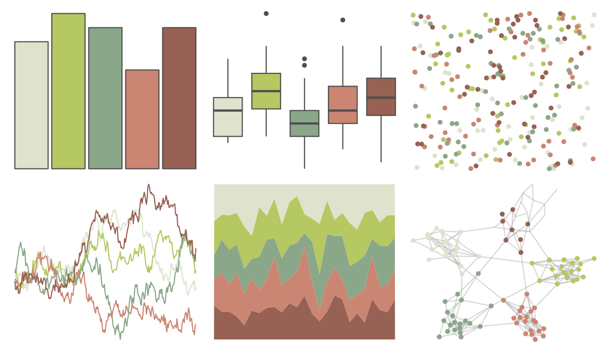

# calecopal - arbutus 

::: columns
::: {.column width="50%"}

**Github**

[an-bui/calecopal](https://github.com/an-bui/calecopal)
:::

::: {.column width="50%"}

**CRAN**

Not on CRAN
:::
:::

<hr> 

Use with [paletteer](https://emilhvitfeldt.github.io/paletteer/) package:

```r
library(paletteer)
paletteer_d("calecopal::arbutus")
```

Use raw:

```r
c("#DFE3CEFF", "#B5C861FF", "#8AA789FF", "#CB8573FF", "#976153FF")
``` 

 

<br>

# Related Palettes

<div class="list" style="display: grid; grid-template-columns: auto auto auto;"> <figure class="figure">
<a href="../../awtools/a_palette/"> </a>
</figure> <figure class="figure">
<a href="../../ButterflyColors/hamadryas_feronia/"> </a>
</figure> <figure class="figure">
<a href="../../ButterflyColors/hamadryas_feronia/"> </a>
</figure> <figure class="figure">
<a href="../../lisa/J_M_W_Turner/"> </a>
</figure> <figure class="figure">
<a href="../../lisa/PaulKlee/"> </a>
</figure> <figure class="figure">
<a href="../../fishualize/Oncorhynchus_tshawytscha/"> </a>
</figure> <figure class="figure">
<a href="../../lisa/AndyWarhol_3/"> </a>
</figure> <figure class="figure">
<a href="../../Redmonder/qMSOMed/"> </a>
</figure> <figure class="figure">
<a href="../../ggthemes/excel_Median/"> </a>
</figure> <figure class="figure">
<a href="../../beyonce/X39/"> </a>
</figure> <figure class="figure">
<a href="../../fishualize/Oncorhynchus_mykiss/"> </a>
</figure> <figure class="figure">
<a href="../../rcartocolor/Earth/"> </a>
</figure> 
</div>
