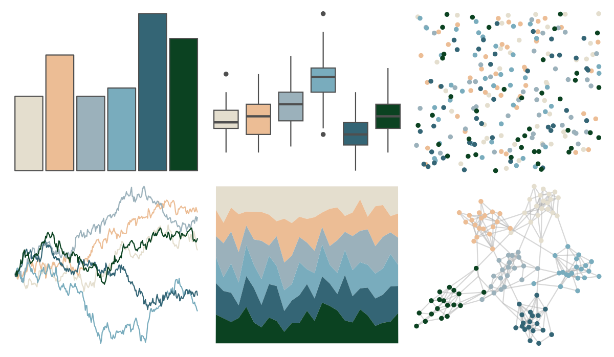

# calecopal - bigsur 

::: columns
::: {.column width="50%"}

**Github**

[an-bui/calecopal](https://github.com/an-bui/calecopal)
:::

::: {.column width="50%"}

**CRAN**

Not on CRAN
:::
:::

<hr> 

Use with [paletteer](https://emilhvitfeldt.github.io/paletteer/) package:

```r
library(paletteer)
paletteer_d("calecopal::bigsur")
```

Use raw:

```r
c("#E4DECEFF", "#ECBD95FF", "#9BB1BBFF", "#79ACBDFF", "#346575FF", "#0B4221FF")
``` 

 

<br>

# Related Palettes

<div class="list" style="display: grid; grid-template-columns: auto auto auto;"> <figure class="figure">
<a href="../../amerika/Dem_Ind_Rep3/"> </a>
</figure> <figure class="figure">
<a href="../../Manu/Kotare/"> </a>
</figure> <figure class="figure">
<a href="../../PrettyCols/Coast/"> </a>
</figure> <figure class="figure">
<a href="../../rtist/hokusai/"> </a>
</figure> <figure class="figure">
<a href="../../nationalparkcolors/CraterLake/"> </a>
</figure> <figure class="figure">
<a href="../../nationalparkcolors/GreatBasin/"> </a>
</figure> <figure class="figure">
<a href="../../nord/baie_mouton/"> </a>
</figure> <figure class="figure">
<a href="../../MetBrewer/Derain/"> </a>
</figure> <figure class="figure">
<a href="../../vangogh/Landscape/"> </a>
</figure> <figure class="figure">
<a href="../../NatParksPalettes/KingsCanyon/"> </a>
</figure> <figure class="figure">
<a href="../../MoMAColors/Rattner/"> </a>
</figure> <figure class="figure">
<a href="../../beyonce/X63/"> </a>
</figure> 
</div>
