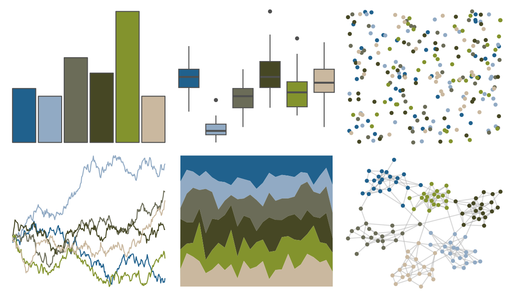

# calecopal - bigsur2 

::: columns
::: {.column width="50%"}

**Github**

[an-bui/calecopal](https://github.com/an-bui/calecopal)
:::

::: {.column width="50%"}

**CRAN**

Not on CRAN
:::
:::

<hr> 

Use with [paletteer](https://emilhvitfeldt.github.io/paletteer/) package:

```r
library(paletteer)
paletteer_d("calecopal::bigsur2")
```

Use raw:

```r
c("#20618DFF", "#91AAC4FF", "#6B6C58FF", "#464724FF", "#83932DFF", "#CAB89FFF")
``` 

 

<br>

# Related Palettes

<div class="list" style="display: grid; grid-template-columns: auto auto auto;"> <figure class="figure">
<a href="../../amerika/Dem_Ind_Rep3/"> </a>
</figure> <figure class="figure">
<a href="../../NatParksPalettes/IguazuFalls/"> </a>
</figure> <figure class="figure">
<a href="../../lisa/Michelangelo/"> </a>
</figure> <figure class="figure">
<a href="../../Manu/Kotare/"> </a>
</figure> <figure class="figure">
<a href="../../vangogh/Irises/"> </a>
</figure> <figure class="figure">
<a href="../../calecopal/halfdome/"> </a>
</figure> <figure class="figure">
<a href="../../lisa/KarlZerbe/"> </a>
</figure> <figure class="figure">
<a href="../../MoMAColors/Dali/"> </a>
</figure> <figure class="figure">
<a href="../../lisa/WassilyKandinsky/"> </a>
</figure> <figure class="figure">
<a href="../../lisa/ClaudeMonet_2/"> </a>
</figure> <figure class="figure">
<a href="../../fishualize/Epinephelus_marginatus/"> </a>
</figure> <figure class="figure">
<a href="../../colRoz/salt_lake/"> </a>
</figure> 
</div>
