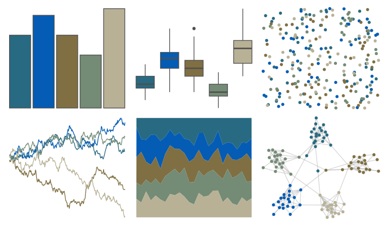

# calecopal - bixby 

::: columns
::: {.column width="50%"}

**Github**

[an-bui/calecopal](https://github.com/an-bui/calecopal)
:::

::: {.column width="50%"}

**CRAN**

Not on CRAN
:::
:::

<hr> 

Use with [paletteer](https://emilhvitfeldt.github.io/paletteer/) package:

```r
library(paletteer)
paletteer_d("calecopal::bixby")
```

Use raw:

```r
c("#286A81FF", "#045CB4FF", "#7F6F43FF", "#748B75FF", "#B8B196FF")
``` 

 

<br>

# Related Palettes

<div class="list" style="display: grid; grid-template-columns: auto auto auto;"> <figure class="figure">
<a href="../../awtools/a_palette/"> </a>
</figure> <figure class="figure">
<a href="../../calecopal/halfdome/"> </a>
</figure> <figure class="figure">
<a href="../../fishualize/Scarus_zelindae/"> </a>
</figure> <figure class="figure">
<a href="../../calecopal/bigsur2/"> </a>
</figure> <figure class="figure">
<a href="../../lisa/Michelangelo/"> </a>
</figure> <figure class="figure">
<a href="../../NatParksPalettes/Banff/"> </a>
</figure> <figure class="figure">
<a href="../../colRoz/k_tristis/"> </a>
</figure> <figure class="figure">
<a href="../../MetBrewer/Derain/"> </a>
</figure> <figure class="figure">
<a href="../../colRoz/c_decresii/"> </a>
</figure> <figure class="figure">
<a href="../../Manu/Kotare/"> </a>
</figure> <figure class="figure">
<a href="../../NatParksPalettes/CraterLake/"> </a>
</figure> <figure class="figure">
<a href="../../ghibli/MarnieMedium1/"> </a>
</figure> 
</div>
