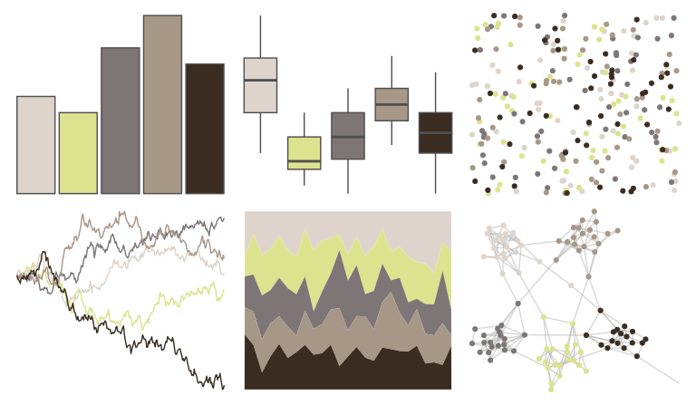

# calecopal - buow 

::: columns
::: {.column width="50%"}

**Github**

[an-bui/calecopal](https://github.com/an-bui/calecopal)
:::

::: {.column width="50%"}

**CRAN**

Not on CRAN
:::
:::

<hr> 

Use with [paletteer](https://emilhvitfeldt.github.io/paletteer/) package:

```r
library(paletteer)
paletteer_d("calecopal::buow")
```

Use raw:

```r
c("#DED4CBFF", "#DBE38EFF", "#7E7576FF", "#A79787FF", "#3A2C21FF")
``` 

 

<br>

# Related Palettes

<div class="list" style="display: grid; grid-template-columns: auto auto auto;"> <figure class="figure">
<a href="../../awtools/a_palette/"> </a>
</figure> <figure class="figure">
<a href="../../nationalparkcolors/MtMckinley/"> </a>
</figure> <figure class="figure">
<a href="../../calecopal/creek/"> </a>
</figure> <figure class="figure">
<a href="../../calecopal/caqu/"> </a>
</figure> <figure class="figure">
<a href="../../fishualize/Esox_lucius/"> </a>
</figure> <figure class="figure">
<a href="../../beyonce/X10/"> </a>
</figure> <figure class="figure">
<a href="../../calecopal/seagrass/"> </a>
</figure> <figure class="figure">
<a href="../../ochRe/winmar/"> </a>
</figure> <figure class="figure">
<a href="../../beyonce/X39/"> </a>
</figure> <figure class="figure">
<a href="../../colRoz/spinifex/"> </a>
</figure> <figure class="figure">
<a href="../../lisa/OttoDix_1/"> </a>
</figure> <figure class="figure">
<a href="../../lisa/SalvadorDali_1/"> </a>
</figure> 
</div>
