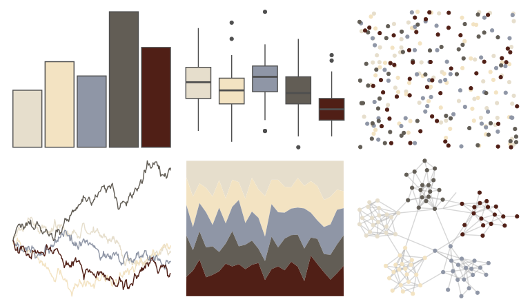

# calecopal - caqu 

::: columns
::: {.column width="50%"}

**Github**

[an-bui/calecopal](https://github.com/an-bui/calecopal)
:::

::: {.column width="50%"}

**CRAN**

Not on CRAN
:::
:::

<hr> 

Use with [paletteer](https://emilhvitfeldt.github.io/paletteer/) package:

```r
library(paletteer)
paletteer_d("calecopal::caqu")
```

Use raw:

```r
c("#E6DECCFF", "#F3E3C2FF", "#8F96A6FF", "#625D55FF", "#501F16FF")
``` 

 

<br>

# Related Palettes

<div class="list" style="display: grid; grid-template-columns: auto auto auto;"> <figure class="figure">
<a href="../../awtools/a_palette/"> </a>
</figure> <figure class="figure">
<a href="../../nationalparkcolors/MtMckinley/"> </a>
</figure> <figure class="figure">
<a href="../../calecopal/coastaldune2/"> </a>
</figure> <figure class="figure">
<a href="../../calecopal/buow/"> </a>
</figure> <figure class="figure">
<a href="../../beyonce/X10/"> </a>
</figure> <figure class="figure">
<a href="../../ggpomological/pomological_base/"> </a>
</figure> <figure class="figure">
<a href="../../calecopal/creek/"> </a>
</figure> <figure class="figure">
<a href="../../nationalparkcolors/GreatBasin/"> </a>
</figure> <figure class="figure">
<a href="../../lisa/JoanMiro/"> </a>
</figure> <figure class="figure">
<a href="../../colRoz/e_kingii/"> </a>
</figure> <figure class="figure">
<a href="../../fishualize/Sander_lucioperca/"> </a>
</figure> <figure class="figure">
<a href="../../IslamicArt/alhambra/"> </a>
</figure> 
</div>
