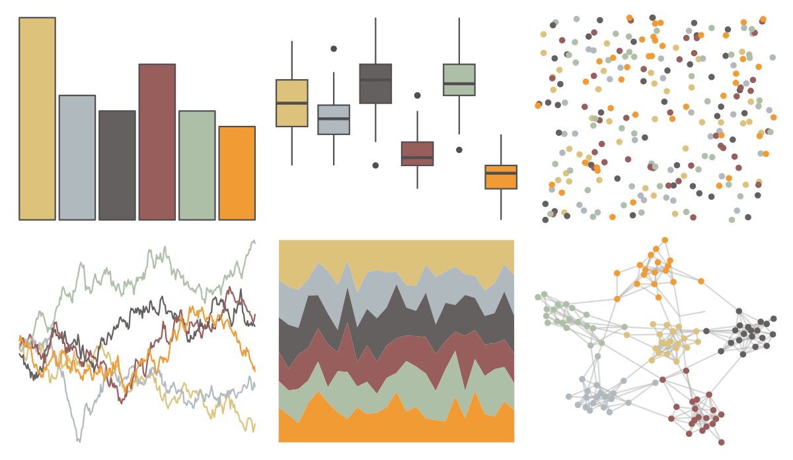

# calecopal - chaparral1 

::: columns
::: {.column width="50%"}

**Github**

[an-bui/calecopal](https://github.com/an-bui/calecopal)
:::

::: {.column width="50%"}

**CRAN**

Not on CRAN
:::
:::

<hr> 

Use with [paletteer](https://emilhvitfeldt.github.io/paletteer/) package:

```r
library(paletteer)
paletteer_d("calecopal::chaparral1")
```

Use raw:

```r
c("#DCC27AFF", "#B0B9BEFF", "#63605FFF", "#985E5CFF", "#AEBFA8FF", "#F19B34FF")
``` 

 

<br>

# Related Palettes

<div class="list" style="display: grid; grid-template-columns: auto auto auto;"> <figure class="figure">
<a href="../../awtools/a_palette/"> </a>
</figure> <figure class="figure">
<a href="../../ButterflyColors/hamadryas_feronia/"> </a>
</figure> <figure class="figure">
<a href="../../ButterflyColors/hamadryas_feronia/"> </a>
</figure> <figure class="figure">
<a href="../../ggthemes/excel_Crop/"> </a>
</figure> <figure class="figure">
<a href="../../ggthemes/excel_Parcel/"> </a>
</figure> <figure class="figure">
<a href="../../Redmonder/qMSOMed/"> </a>
</figure> <figure class="figure">
<a href="../../yarrr/decision/"> </a>
</figure> <figure class="figure">
<a href="../../ggthemes/excel_Median/"> </a>
</figure> <figure class="figure">
<a href="../../ggthemes/excel_Paper/"> </a>
</figure> <figure class="figure">
<a href="../../nationalparkcolors/BryceCanyon/"> </a>
</figure> <figure class="figure">
<a href="../../Redmonder/qMSOOr/"> </a>
</figure> <figure class="figure">
<a href="../../nationalparkcolors/Redwoods/"> </a>
</figure> 
</div>
