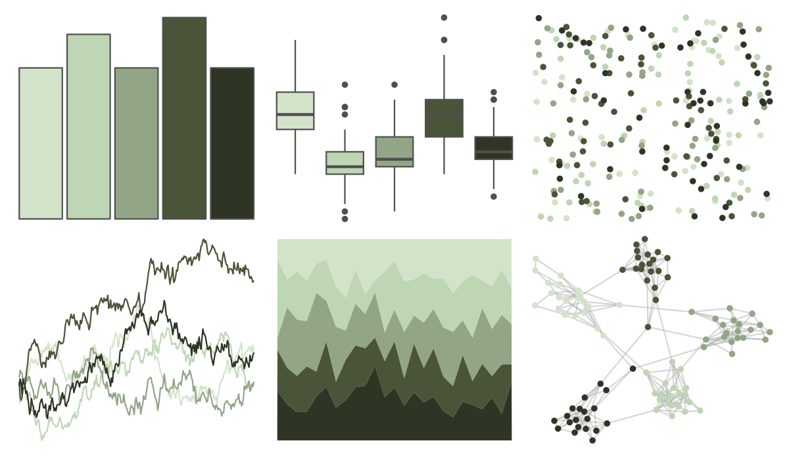

# calecopal - chaparral3 

::: columns
::: {.column width="50%"}

**Github**

[an-bui/calecopal](https://github.com/an-bui/calecopal)
:::

::: {.column width="50%"}

**CRAN**

Not on CRAN
:::
:::

<hr> 

Use with [paletteer](https://emilhvitfeldt.github.io/paletteer/) package:

```r
library(paletteer)
paletteer_d("calecopal::chaparral3")
```

Use raw:

```r
c("#D3E3CAFF", "#BED6B3FF", "#92A587FF", "#4A5438FF", "#2F3525FF")
``` 

 

<br>

# Related Palettes

<div class="list" style="display: grid; grid-template-columns: auto auto auto;"> <figure class="figure">
<a href="../../amerika/Dem_Ind_Rep3/"> </a>
</figure> <figure class="figure">
<a href="../../fishualize/Paralabrax_clathratus/"> </a>
</figure> <figure class="figure">
<a href="../../MetBrewer/VanGogh3/"> </a>
</figure> <figure class="figure">
<a href="../../MexBrewer/Concha/"> </a>
</figure> <figure class="figure">
<a href="../../palettetown/diglett/"> </a>
</figure> <figure class="figure">
<a href="../../lisa/OttoDix_1/"> </a>
</figure> <figure class="figure">
<a href="../../yarrr/bugs/"> </a>
</figure> <figure class="figure">
<a href="../../palettetown/geodude/"> </a>
</figure> <figure class="figure">
<a href="../../lisa/JohnQuidor/"> </a>
</figure> <figure class="figure">
<a href="../../ButterflyColors/dynamine_postverta/"> </a>
</figure> <figure class="figure">
<a href="../../palettetown/graveler/"> </a>
</figure> <figure class="figure">
<a href="../../werpals/monet/"> </a>
</figure> 
</div>
