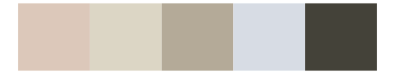
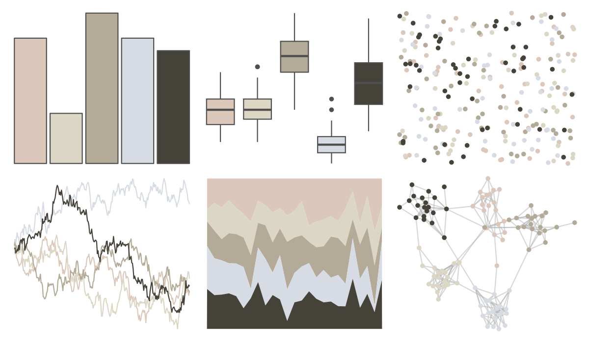

# calecopal - coastaldune1 

::: columns
::: {.column width="50%"}

**Github**

[an-bui/calecopal](https://github.com/an-bui/calecopal)
:::

::: {.column width="50%"}

**CRAN**

Not on CRAN
:::
:::

<hr> 

Use with [paletteer](https://emilhvitfeldt.github.io/paletteer/) package:

```r
library(paletteer)
paletteer_d("calecopal::coastaldune1")
```

Use raw:

```r
c("#DCC8BAFF", "#DCD6C5FF", "#B4AA98FF", "#D7DCE4FF", "#444239FF")
``` 

 

<br>

# Related Palettes

<div class="list" style="display: grid; grid-template-columns: auto auto auto;"> <figure class="figure">
<a href="../../amerika/Dem_Ind_Rep3/"> </a>
</figure> <figure class="figure">
<a href="../../lisa/SalvadorDali_1/"> </a>
</figure> <figure class="figure">
<a href="../../fishualize/Mugil_liza/"> </a>
</figure> <figure class="figure">
<a href="../../palettetown/onix/"> </a>
</figure> <figure class="figure">
<a href="../../lisa/PaulKlee/"> </a>
</figure> <figure class="figure">
<a href="../../palettetown/pinsir/"> </a>
</figure> <figure class="figure">
<a href="../../tayloRswift/TSTTPD/"> </a>
</figure> <figure class="figure">
<a href="../../calecopal/creek/"> </a>
</figure> <figure class="figure">
<a href="../../lisa/AlbrechtDurer/"> </a>
</figure> <figure class="figure">
<a href="../../palettetown/unown/"> </a>
</figure> <figure class="figure">
<a href="../../colRoz/shark_bay/"> </a>
</figure> <figure class="figure">
<a href="../../nationalparkcolors/MtMckinley/"> </a>
</figure> 
</div>
