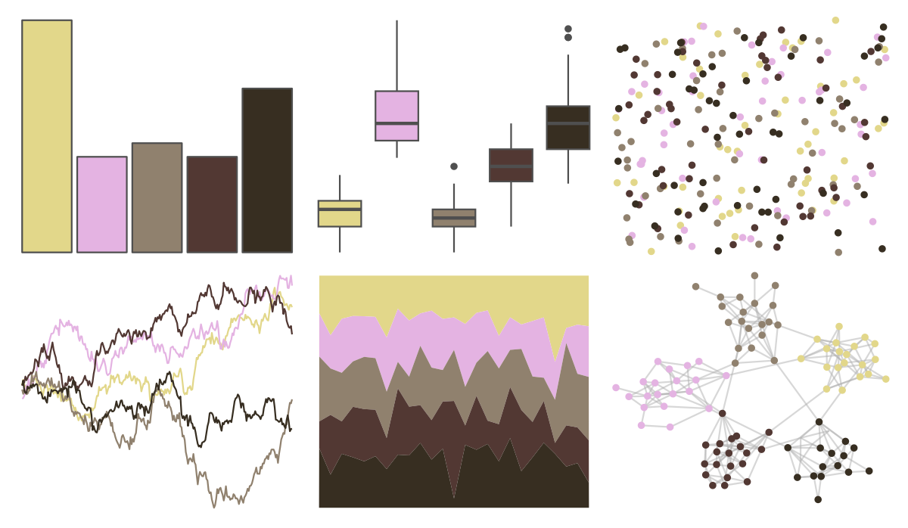
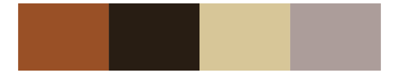

# calecopal - coastaldune2 

::: columns
::: {.column width="50%"}

**Github**

[an-bui/calecopal](https://github.com/an-bui/calecopal)
:::

::: {.column width="50%"}

**CRAN**

Not on CRAN
:::
:::

<hr> 

Use with [paletteer](https://emilhvitfeldt.github.io/paletteer/) package:

```r
library(paletteer)
paletteer_d("calecopal::coastaldune2")
```

Use raw:

```r
c("#E2D78AFF", "#E4B3E2FF", "#90816EFF", "#523833FF", "#372E21FF")
``` 

 

<br>

# Related Palettes

<div class="list" style="display: grid; grid-template-columns: auto auto auto;"> <figure class="figure">
<a href="../../amerika/Dem_Ind_Rep3/"> </a>
</figure> <figure class="figure">
<a href="../../wesanderson/IsleofDogs1/"> </a>
</figure> <figure class="figure">
<a href="../../calecopal/caqu/"> </a>
</figure> <figure class="figure">
<a href="../../rockthemes/hellawaits/"> </a>
</figure> <figure class="figure">
<a href="../../IslamicArt/alhambra/"> </a>
</figure> <figure class="figure">
<a href="../../beyonce/X10/"> </a>
</figure> <figure class="figure">
<a href="../../MoMAColors/Levine1/"> </a>
</figure> <figure class="figure">
<a href="../../lisa/EdgarDegas/"> </a>
</figure> <figure class="figure">
<a href="../../lisa/JamesJean/"> </a>
</figure> <figure class="figure">
<a href="../../lisa/JoanMiro/"> </a>
</figure> <figure class="figure">
<a href="../../fishualize/Ostorhinchus_angustatus/"> </a>
</figure> <figure class="figure">
<a href="../../lisa/LucianFreud/"> </a>
</figure> 
</div>
