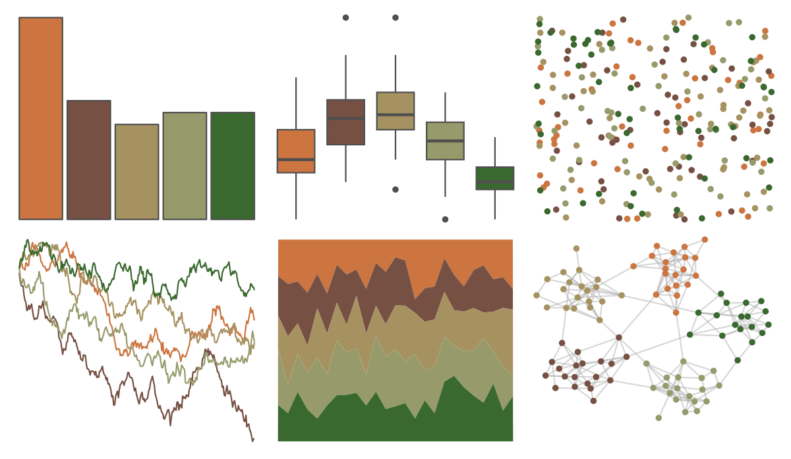

# calecopal - conifer 

::: columns
::: {.column width="50%"}

**Github**

[an-bui/calecopal](https://github.com/an-bui/calecopal)
:::

::: {.column width="50%"}

**CRAN**

Not on CRAN
:::
:::

<hr> 

Use with [paletteer](https://emilhvitfeldt.github.io/paletteer/) package:

```r
library(paletteer)
paletteer_d("calecopal::conifer")
```

Use raw:

```r
c("#CC7540FF", "#765043FF", "#A69260FF", "#979A6BFF", "#39692FFF")
``` 

 

<br>

# Related Palettes

<div class="list" style="display: grid; grid-template-columns: auto auto auto;"> <figure class="figure">
<a href="../../amerika/Dem_Ind_Rep3/"> </a>
</figure> <figure class="figure">
<a href="../../vangogh/SunflowersLondon/"> </a>
</figure> <figure class="figure">
<a href="../../fishualize/Petromyzon_marinus/"> </a>
</figure> <figure class="figure">
<a href="../../vangogh/Shoes/"> </a>
</figure> <figure class="figure">
<a href="../../lisa/PaulCezanne/"> </a>
</figure> <figure class="figure">
<a href="../../rtist/klimt/"> </a>
</figure> <figure class="figure">
<a href="../../fishualize/Barbus_barbus/"> </a>
</figure> <figure class="figure">
<a href="../../ggthemes/excel_Orange/"> </a>
</figure> <figure class="figure">
<a href="../../ggthemes/excel_Retrospect/"> </a>
</figure> <figure class="figure">
<a href="../../vangogh/CafeDeNuit/"> </a>
</figure> <figure class="figure">
<a href="../../nord/moose_pond/"> </a>
</figure> <figure class="figure">
<a href="../../ggthemes/excel_Wisp/"> </a>
</figure> 
</div>
