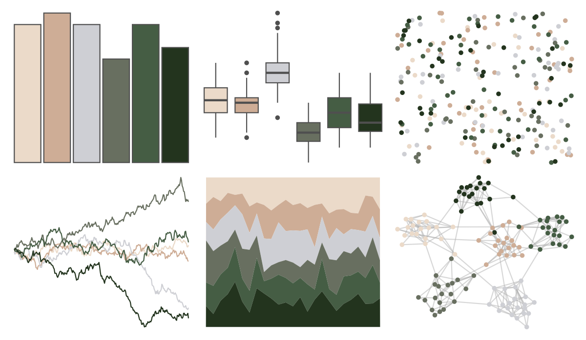

# calecopal - creek 

::: columns
::: {.column width="50%"}

**Github**

[an-bui/calecopal](https://github.com/an-bui/calecopal)
:::

::: {.column width="50%"}

**CRAN**

Not on CRAN
:::
:::

<hr> 

Use with [paletteer](https://emilhvitfeldt.github.io/paletteer/) package:

```r
library(paletteer)
paletteer_d("calecopal::creek")
```

Use raw:

```r
c("#EBDAC9FF", "#CEAD96FF", "#CECFD4FF", "#686F60FF", "#455D44FF", "#23341EFF")
``` 

 

<br>

# Related Palettes

<div class="list" style="display: grid; grid-template-columns: auto auto auto;"> <figure class="figure">
<a href="../../amerika/Dem_Ind_Rep3/"> </a>
</figure> <figure class="figure">
<a href="../../poisonfrogs/Bpicturata/"> </a>
</figure> <figure class="figure">
<a href="../../tayloRswift/midnightsMahogany/"> </a>
</figure> <figure class="figure">
<a href="../../Rdune/harkonnen3/"> </a>
</figure> <figure class="figure">
<a href="../../fishualize/Esox_lucius/"> </a>
</figure> <figure class="figure">
<a href="../../Rdune/fermen/"> </a>
</figure> <figure class="figure">
<a href="../../fishualize/Lile_piquitinga/"> </a>
</figure> <figure class="figure">
<a href="../../calecopal/buow/"> </a>
</figure> <figure class="figure">
<a href="../../Rdune/sandworm/"> </a>
</figure> <figure class="figure">
<a href="../../lisa/OttoDix_1/"> </a>
</figure> <figure class="figure">
<a href="../../poisonfrogs/Hhobbsi/"> </a>
</figure> <figure class="figure">
<a href="../../colRoz/shark_bay/"> </a>
</figure> 
</div>
