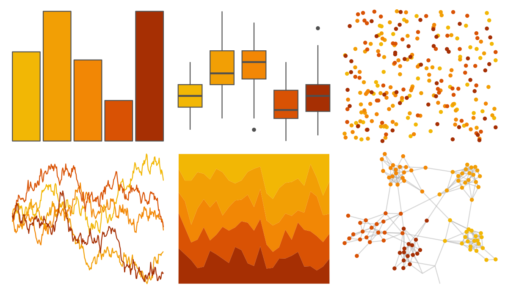

# calecopal - eschscholzia 

::: columns
::: {.column width="50%"}

**Github**

[an-bui/calecopal](https://github.com/an-bui/calecopal)
:::

::: {.column width="50%"}

**CRAN**

Not on CRAN
:::
:::

<hr> 

Use with [paletteer](https://emilhvitfeldt.github.io/paletteer/) package:

```r
library(paletteer)
paletteer_d("calecopal::eschscholzia")
```

Use raw:

```r
c("#F2B705FF", "#F29F05FF", "#F28705FF", "#D95204FF", "#A62F03FF")
``` 

 

<br>

# Related Palettes

<div class="list" style="display: grid; grid-template-columns: auto auto auto;"> <figure class="figure">
<a href="../../awtools/a_palette/"> </a>
</figure> <figure class="figure">
<a href="../../ButterflyColors/hamadryas_feronia/"> </a>
</figure> <figure class="figure">
<a href="../../ButterflyColors/hamadryas_feronia/"> </a>
</figure> <figure class="figure">
<a href="../../fishualize/Labrisomus_nuchipinnis/"> </a>
</figure> <figure class="figure">
<a href="../../ggthemes/excel_Red_Orange/"> </a>
</figure> <figure class="figure">
<a href="../../fishualize/Hippocampus_reidi/"> </a>
</figure> <figure class="figure">
<a href="../../fishualize/Holocentrus_adscensionis/"> </a>
</figure> <figure class="figure">
<a href="../../fishualize/Dermatolepis_inermis/"> </a>
</figure> <figure class="figure">
<a href="../../lisa/MarkRothko/"> </a>
</figure> <figure class="figure">
<a href="../../ggprism/flames/"> </a>
</figure> <figure class="figure">
<a href="../../fishualize/Chormis_multilineata/"> </a>
</figure> <figure class="figure">
<a href="../../calecopal/canary/"> </a>
</figure> 
</div>
