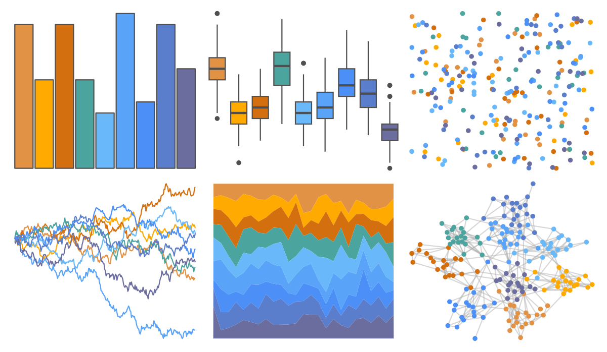
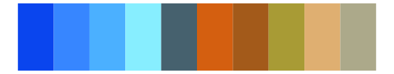

# calecopal - figmtn 

::: columns
::: {.column width="50%"}

**Github**

[an-bui/calecopal](https://github.com/an-bui/calecopal)
:::

::: {.column width="50%"}

**CRAN**

Not on CRAN
:::
:::

<hr> 

Use with [paletteer](https://emilhvitfeldt.github.io/paletteer/) package:

```r
library(paletteer)
paletteer_d("calecopal::figmtn")
```

Use raw:

```r
c("#E29244FF", "#FFAA00FF", "#D46F10FF", "#4CA49EFF", "#69B9FAFF", "#59A3F8FF", "#4B8FF7FF", "#5A7ECBFF", "#6B6D9FFF")
``` 

 

<br>

# Related Palettes

<div class="list" style="display: grid; grid-template-columns: auto auto auto;"> <figure class="figure">
<a href="../../amerika/Dem_Ind_Rep3/"> </a>
</figure> <figure class="figure">
<a href="../../ggthemes/Color_Blind/"> </a>
</figure> <figure class="figure">
<a href="../../NatParksPalettes/Yellowstone/"> </a>
</figure> <figure class="figure">
<a href="../../ggthemes/Classic_Color_Blind/"> </a>
</figure> <figure class="figure">
<a href="../../MetBrewer/Hiroshige/"> </a>
</figure> <figure class="figure">
<a href="../../MetBrewer/Nizami/"> </a>
</figure> <figure class="figure">
<a href="../../trekcolors/lcars_nemesis/"> </a>
</figure> <figure class="figure">
<a href="../../ggsci/nrc_npg/"> </a>
</figure> <figure class="figure">
<a href="../../Redmonder/qPBI/"> </a>
</figure> <figure class="figure">
<a href="../../ggthemes/Red_Blue_Brown/"> </a>
</figure> <figure class="figure">
<a href="../../ggprism/wool_muffler/"> </a>
</figure> <figure class="figure">
<a href="../../khroma/BuRd/"> </a>
</figure> 
</div>
