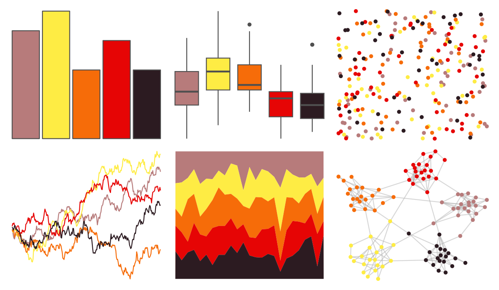

# calecopal - fire 

::: columns
::: {.column width="50%"}

**Github**

[an-bui/calecopal](https://github.com/an-bui/calecopal)
:::

::: {.column width="50%"}

**CRAN**

Not on CRAN
:::
:::

<hr> 

Use with [paletteer](https://emilhvitfeldt.github.io/paletteer/) package:

```r
library(paletteer)
paletteer_d("calecopal::fire")
```

Use raw:

```r
c("#B77B7BFF", "#FEEC44FF", "#F66C09FF", "#E60505FF", "#2C1B21FF")
``` 

 

<br>

# Related Palettes

<div class="list" style="display: grid; grid-template-columns: auto auto auto;"> <figure class="figure">
<a href="../../awtools/a_palette/"> </a>
</figure> <figure class="figure">
<a href="../../fishualize/Salvelinus_fontinalis/"> </a>
</figure> <figure class="figure">
<a href="../../nationalparkcolors/Saguaro/"> </a>
</figure> <figure class="figure">
<a href="../../DresdenColor/changes/"> </a>
</figure> <figure class="figure">
<a href="../../fishualize/Pterois_volitans/"> </a>
</figure> <figure class="figure">
<a href="../../feathers/spotted_pardalote/"> </a>
</figure> <figure class="figure">
<a href="../../nationalparkcolors/Hawaii/"> </a>
</figure> <figure class="figure">
<a href="../../fishualize/Aulostomus_chinensis/"> </a>
</figure> <figure class="figure">
<a href="../../palettetown/teamrocket/"> </a>
</figure> <figure class="figure">
<a href="../../colRoz/whitei/"> </a>
</figure> <figure class="figure">
<a href="../../tvthemes/CrazyLaceAgate/"> </a>
</figure> <figure class="figure">
<a href="../../tvthemes/Martell/"> </a>
</figure> 
</div>
