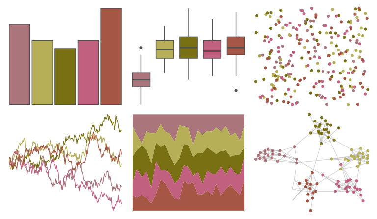

# calecopal - gayophytum 

::: columns
::: {.column width="50%"}

**Github**

[an-bui/calecopal](https://github.com/an-bui/calecopal)
:::

::: {.column width="50%"}

**CRAN**

Not on CRAN
:::
:::

<hr> 

Use with [paletteer](https://emilhvitfeldt.github.io/paletteer/) package:

```r
library(paletteer)
paletteer_d("calecopal::gayophytum")
```

Use raw:

```r
c("#AA767CFF", "#B7AF57FF", "#797014FF", "#C2607FFF", "#A65644FF")
``` 

 

<br>

# Related Palettes

<div class="list" style="display: grid; grid-template-columns: auto auto auto;"> <figure class="figure">
<a href="../../awtools/a_palette/"> </a>
</figure> <figure class="figure">
<a href="../../NatParksPalettes/Halekala/"> </a>
</figure> <figure class="figure">
<a href="../../NatParksPalettes/BryceCanyon/"> </a>
</figure> <figure class="figure">
<a href="../../colRoz/desert_flood/"> </a>
</figure> <figure class="figure">
<a href="../../lisa/JacobLawrence/"> </a>
</figure> <figure class="figure">
<a href="../../rtist/klimt/"> </a>
</figure> <figure class="figure">
<a href="../../fishualize/Barbus_barbus/"> </a>
</figure> <figure class="figure">
<a href="../../calecopal/dudleya/"> </a>
</figure> <figure class="figure">
<a href="../../rockthemes/peacesells/"> </a>
</figure> <figure class="figure">
<a href="../../lisa/MiltonAvery/"> </a>
</figure> <figure class="figure">
<a href="../../colRoz/grandis/"> </a>
</figure> <figure class="figure">
<a href="../../lisa/JamesJean/"> </a>
</figure> 
</div>
