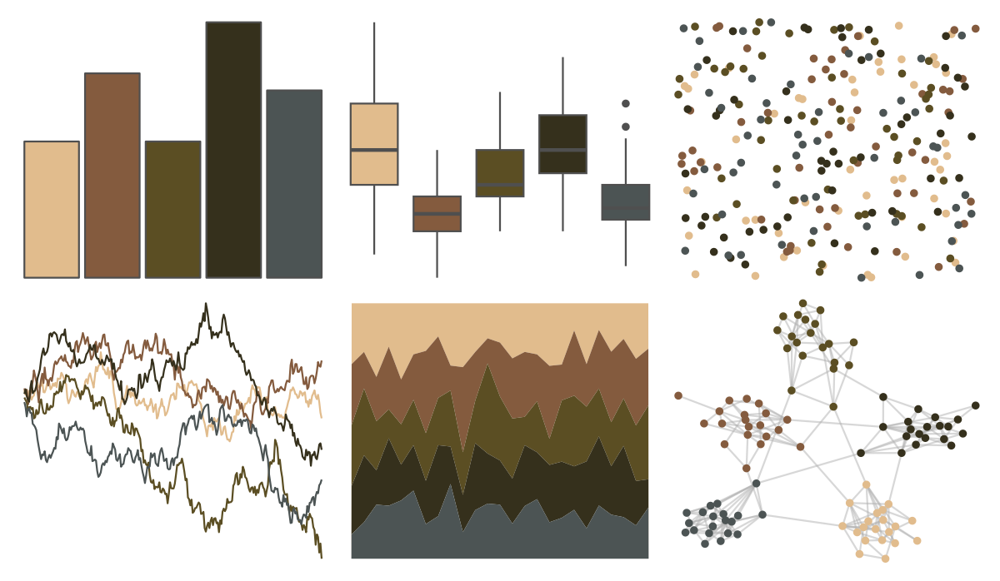
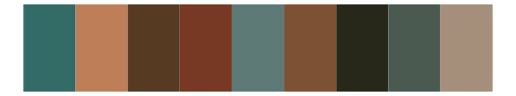

# calecopal - grassdry 

::: columns
::: {.column width="50%"}

**Github**

[an-bui/calecopal](https://github.com/an-bui/calecopal)
:::

::: {.column width="50%"}

**CRAN**

Not on CRAN
:::
:::

<hr> 

Use with [paletteer](https://emilhvitfeldt.github.io/paletteer/) package:

```r
library(paletteer)
paletteer_d("calecopal::grassdry")
```

Use raw:

```r
c("#E1BC8DFF", "#845B3EFF", "#5B4E23FF", "#35301CFF", "#4C5454FF")
``` 

 

<br>

# Related Palettes

<div class="list" style="display: grid; grid-template-columns: auto auto auto;"> <figure class="figure">
<a href="../../amerika/Dem_Ind_Rep3/"> </a>
</figure> <figure class="figure">
<a href="../../rtist/degas/"> </a>
</figure> <figure class="figure">
<a href="../../colRoz/p_cincta/"> </a>
</figure> <figure class="figure">
<a href="../../tayloRswift/SunriseBoulevard1989/"> </a>
</figure> <figure class="figure">
<a href="../../MoMAColors/Levine1/"> </a>
</figure> <figure class="figure">
<a href="../../nbapalettes/heat_military/"> </a>
</figure> <figure class="figure">
<a href="../../lisa/LucianFreud/"> </a>
</figure> <figure class="figure">
<a href="../../nbapalettes/raptors_city/"> </a>
</figure> <figure class="figure">
<a href="../../lisa/Pierre_AugusteRenoir_1/"> </a>
</figure> <figure class="figure">
<a href="../../lisa/MaxErnst/"> </a>
</figure> <figure class="figure">
<a href="../../lisa/EdgarDegas/"> </a>
</figure> <figure class="figure">
<a href="../../peRReo/nicky/"> </a>
</figure> 
</div>
