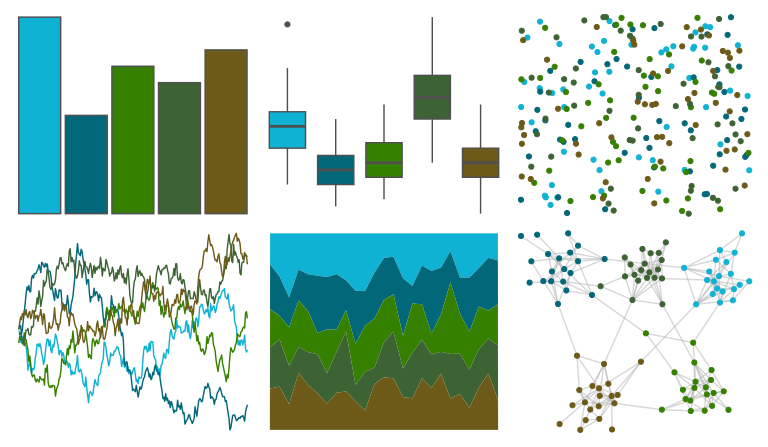

# calecopal - kelp2 

::: columns
::: {.column width="50%"}

**Github**

[an-bui/calecopal](https://github.com/an-bui/calecopal)
:::

::: {.column width="50%"}

**CRAN**

Not on CRAN
:::
:::

<hr> 

Use with [paletteer](https://emilhvitfeldt.github.io/paletteer/) package:

```r
library(paletteer)
paletteer_d("calecopal::kelp2")
```

Use raw:

```r
c("#0FB2D3FF", "#026779FF", "#368000FF", "#3D6334FF", "#6D5A18FF")
``` 

 

<br>

# Related Palettes

<div class="list" style="display: grid; grid-template-columns: auto auto auto;"> <figure class="figure">
<a href="../../awtools/a_palette/"> </a>
</figure> <figure class="figure">
<a href="../../NatParksPalettes/Everglades/"> </a>
</figure> <figure class="figure">
<a href="../../fishualize/Balistes_vetula/"> </a>
</figure> <figure class="figure">
<a href="../../NatParksPalettes/Banff/"> </a>
</figure> <figure class="figure">
<a href="../../fishualize/Acanthostracion_polygonius/"> </a>
</figure> <figure class="figure">
<a href="../../fishualize/Scarus_zelindae/"> </a>
</figure> <figure class="figure">
<a href="../../lisa/RichardDiebenkorn/"> </a>
</figure> <figure class="figure">
<a href="../../ggthemes/wsj_black_green/"> </a>
</figure> <figure class="figure">
<a href="../../fishualize/Elagatis_bipinnulata/"> </a>
</figure> <figure class="figure">
<a href="../../LaCroixColoR/Lime/"> </a>
</figure> <figure class="figure">
<a href="../../ggthemes/excel_Blue/"> </a>
</figure> <figure class="figure">
<a href="../../MetBrewer/Tsimshian/"> </a>
</figure> 
</div>
