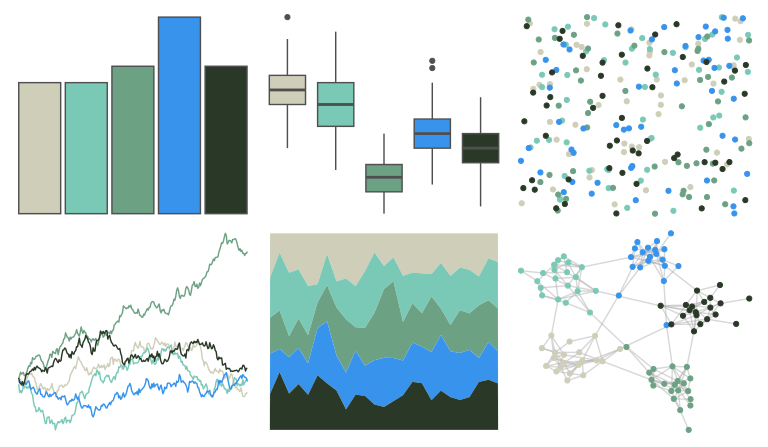

# calecopal - lake 

::: columns
::: {.column width="50%"}

**Github**

[an-bui/calecopal](https://github.com/an-bui/calecopal)
:::

::: {.column width="50%"}

**CRAN**

Not on CRAN
:::
:::

<hr> 

Use with [paletteer](https://emilhvitfeldt.github.io/paletteer/) package:

```r
library(paletteer)
paletteer_d("calecopal::lake")
```

Use raw:

```r
c("#CECEB9FF", "#7AC9B7FF", "#6CA184FF", "#3793ECFF", "#2A3927FF")
``` 

 

<br>

# Related Palettes

<div class="list" style="display: grid; grid-template-columns: auto auto auto;"> <figure class="figure">
<a href="../../awtools/a_palette/"> </a>
</figure> <figure class="figure">
<a href="../../colorBlindness/Blue2Gray8Steps/"> </a>
</figure> <figure class="figure">
<a href="../../dichromat/BluetoGray_8/"> </a>
</figure> <figure class="figure">
<a href="../../nationalparkcolors/GreatBasin/"> </a>
</figure> <figure class="figure">
<a href="../../calecopal/grasswet/"> </a>
</figure> <figure class="figure">
<a href="../../calecopal/sage/"> </a>
</figure> <figure class="figure">
<a href="../../fishualize/Halichoeres_radiatus/"> </a>
</figure> <figure class="figure">
<a href="../../calecopal/sierra2/"> </a>
</figure> <figure class="figure">
<a href="../../tayloRswift/taylorSwift/"> </a>
</figure> <figure class="figure">
<a href="../../lisa/KennethNoland/"> </a>
</figure> <figure class="figure">
<a href="../../lisa/MaryCassatt/"> </a>
</figure> <figure class="figure">
<a href="../../fishualize/Thunnus_obesus/"> </a>
</figure> 
</div>
