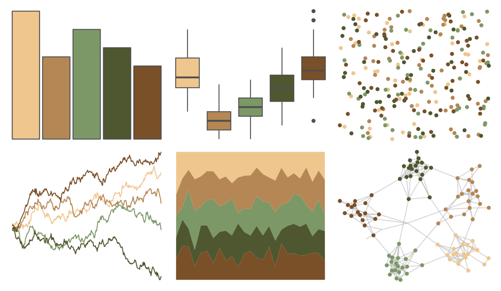

# calecopal - oak 

::: columns
::: {.column width="50%"}

**Github**

[an-bui/calecopal](https://github.com/an-bui/calecopal)
:::

::: {.column width="50%"}

**CRAN**

Not on CRAN
:::
:::

<hr> 

Use with [paletteer](https://emilhvitfeldt.github.io/paletteer/) package:

```r
library(paletteer)
paletteer_d("calecopal::oak")
```

Use raw:

```r
c("#EFC68EFF", "#B58755FF", "#7C9867FF", "#4F5730FF", "#7A5028FF")
``` 

 

<br>

# Related Palettes

<div class="list" style="display: grid; grid-template-columns: auto auto auto;"> <figure class="figure">
<a href="../../awtools/a_palette/"> </a>
</figure> <figure class="figure">
<a href="../../ButterflyColors/hamadryas_feronia/"> </a>
</figure> <figure class="figure">
<a href="../../ButterflyColors/hamadryas_feronia/"> </a>
</figure> <figure class="figure">
<a href="../../soilpalettes/bangor/"> </a>
</figure> <figure class="figure">
<a href="../../rcartocolor/Fall/"> </a>
</figure> <figure class="figure">
<a href="../../lisa/JohnQuidor/"> </a>
</figure> <figure class="figure">
<a href="../../IslamicArt/fes/"> </a>
</figure> <figure class="figure">
<a href="../../ggthemes/excel_Wisp/"> </a>
</figure> <figure class="figure">
<a href="../../vangogh/SunflowersLondon/"> </a>
</figure> <figure class="figure">
<a href="../../vangogh/CafeDeNuit/"> </a>
</figure> <figure class="figure">
<a href="../../tayloRswift/fearless/"> </a>
</figure> <figure class="figure">
<a href="../../MexBrewer/Ofrenda/"> </a>
</figure> 
</div>
