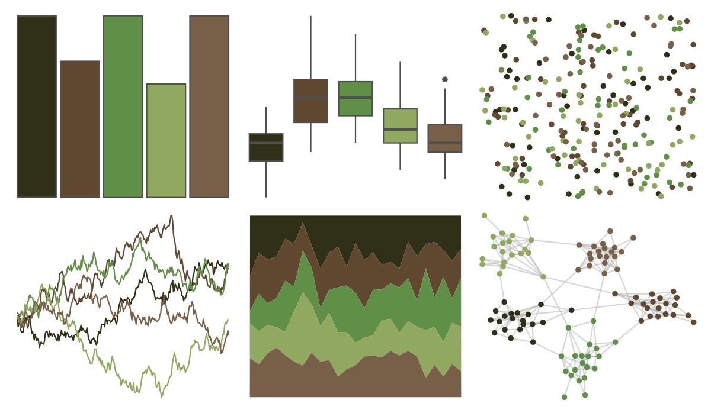

# calecopal - redwood1 

::: columns
::: {.column width="50%"}

**Github**

[an-bui/calecopal](https://github.com/an-bui/calecopal)
:::

::: {.column width="50%"}

**CRAN**

Not on CRAN
:::
:::

<hr> 

Use with [paletteer](https://emilhvitfeldt.github.io/paletteer/) package:

```r
library(paletteer)
paletteer_d("calecopal::redwood1")
```

Use raw:

```r
c("#303018FF", "#604830FF", "#609048FF", "#90A860FF", "#786048FF")
``` 

 

<br>

# Related Palettes

<div class="list" style="display: grid; grid-template-columns: auto auto auto;"> <figure class="figure">
<a href="../../amerika/Dem_Ind_Rep3/"> </a>
</figure> <figure class="figure">
<a href="../../fishualize/Micropterus_punctulatus/"> </a>
</figure> <figure class="figure">
<a href="../../colRoz/c_australasiae/"> </a>
</figure> <figure class="figure">
<a href="../../colRoz/a_conica/"> </a>
</figure> <figure class="figure">
<a href="../../calecopal/agriculture/"> </a>
</figure> <figure class="figure">
<a href="../../ButterflyColors/dynamine_postverta/"> </a>
</figure> <figure class="figure">
<a href="../../poisonfrogs/Hcinerascens/"> </a>
</figure> <figure class="figure">
<a href="../../lisa/ClaudeMonet/"> </a>
</figure> <figure class="figure">
<a href="../../calecopal/conifer/"> </a>
</figure> <figure class="figure">
<a href="../../lisa/DiegoVelazquez/"> </a>
</figure> <figure class="figure">
<a href="../../colRoz/thylacine/"> </a>
</figure> <figure class="figure">
<a href="../../poisonfrogs/Osotokiki/"> </a>
</figure> 
</div>
