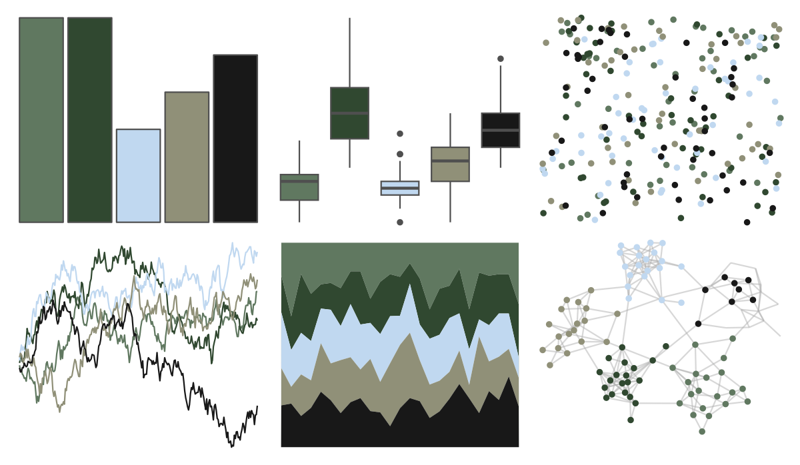

# calecopal - sage 

::: columns
::: {.column width="50%"}

**Github**

[an-bui/calecopal](https://github.com/an-bui/calecopal)
:::

::: {.column width="50%"}

**CRAN**

Not on CRAN
:::
:::

<hr> 

Use with [paletteer](https://emilhvitfeldt.github.io/paletteer/) package:

```r
library(paletteer)
paletteer_d("calecopal::sage")
```

Use raw:

```r
c("#607860FF", "#304830FF", "#C0D8F0FF", "#909078FF", "#181818FF")
``` 

 

<br>

# Related Palettes

<div class="list" style="display: grid; grid-template-columns: auto auto auto;"> <figure class="figure">
<a href="../../amerika/Dem_Ind_Rep3/"> </a>
</figure> <figure class="figure">
<a href="../../lisa/MarkRothko_1/"> </a>
</figure> <figure class="figure">
<a href="../../calecopal/grasswet/"> </a>
</figure> <figure class="figure">
<a href="../../vangogh/Cypresses/"> </a>
</figure> <figure class="figure">
<a href="../../colRoz/i_lesueurii/"> </a>
</figure> <figure class="figure">
<a href="../../calecopal/lake/"> </a>
</figure> <figure class="figure">
<a href="../../ButterflyColors/morpho_helenor/"> </a>
</figure> <figure class="figure">
<a href="../../lisa/Pierre_AugusteRenoir_1/"> </a>
</figure> <figure class="figure">
<a href="../../Manu/Takapu/"> </a>
</figure> <figure class="figure">
<a href="../../DresdenColor/deadbeat/"> </a>
</figure> <figure class="figure">
<a href="../../lisa/EdgarDegas/"> </a>
</figure> <figure class="figure">
<a href="../../tayloRswift/midnightsJadeGreen/"> </a>
</figure> 
</div>
