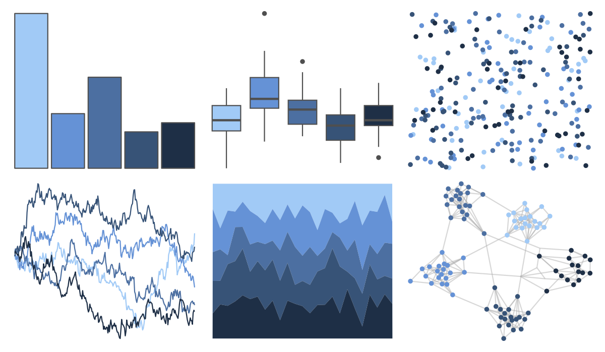

# calecopal - sbchannel 

::: columns
::: {.column width="50%"}

**Github**

[an-bui/calecopal](https://github.com/an-bui/calecopal)
:::

::: {.column width="50%"}

**CRAN**

Not on CRAN
:::
:::

<hr> 

Use with [paletteer](https://emilhvitfeldt.github.io/paletteer/) package:

```r
library(paletteer)
paletteer_d("calecopal::sbchannel")
```

Use raw:

```r
c("#A1CAF6FF", "#6592D6FF", "#4C6FA1FF", "#375377FF", "#1E2F46FF")
``` 

 

<br>

# Related Palettes

<div class="list" style="display: grid; grid-template-columns: auto auto auto;"> <figure class="figure">
<a href="../../amerika/Dem_Ind_Rep3/"> </a>
</figure> <figure class="figure">
<a href="../../colRoz/sky/"> </a>
</figure> <figure class="figure">
<a href="../../beyonce/X15/"> </a>
</figure> <figure class="figure">
<a href="../../unikn/pal_karpfenblau/"> </a>
</figure> <figure class="figure">
<a href="../../MetBrewer/Hokusai2/"> </a>
</figure> <figure class="figure">
<a href="../../colRoz/physalia/"> </a>
</figure> <figure class="figure">
<a href="../../fishualize/Sparisoma_frondosum_m/"> </a>
</figure> <figure class="figure">
<a href="../../Redmonder/qMSOBuWarm/"> </a>
</figure> <figure class="figure">
<a href="../../severance/Dinner/"> </a>
</figure> <figure class="figure">
<a href="../../poisonfrogs/Dtazureus/"> </a>
</figure> <figure class="figure">
<a href="../../Manu/Kokako/"> </a>
</figure> <figure class="figure">
<a href="../../ggsci/indigo_material/"> </a>
</figure> 
</div>
