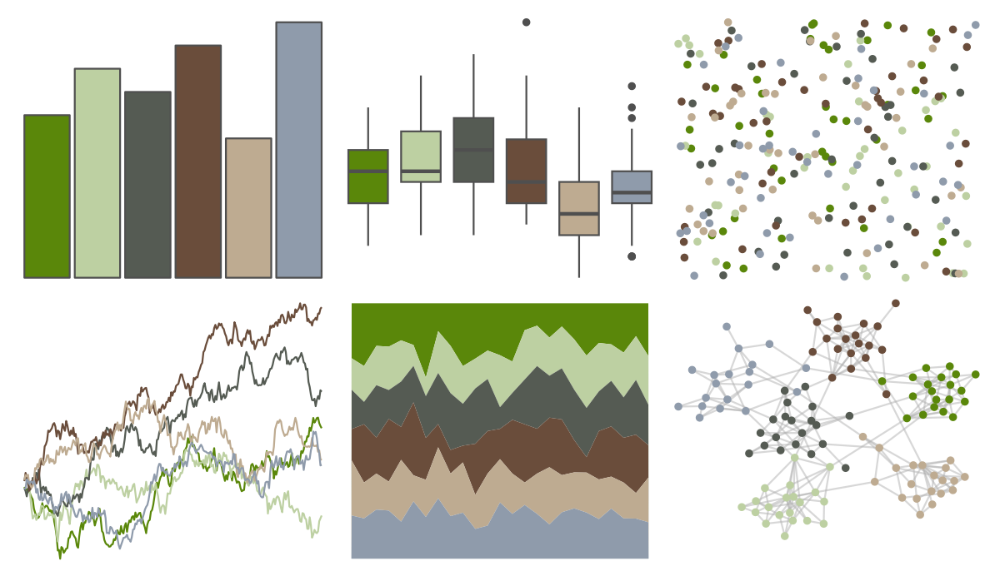

# calecopal - seagrass 

::: columns
::: {.column width="50%"}

**Github**

[an-bui/calecopal](https://github.com/an-bui/calecopal)
:::

::: {.column width="50%"}

**CRAN**

Not on CRAN
:::
:::

<hr> 

Use with [paletteer](https://emilhvitfeldt.github.io/paletteer/) package:

```r
library(paletteer)
paletteer_d("calecopal::seagrass")
```

Use raw:

```r
c("#5A870AFF", "#BDD0A2FF", "#555B53FF", "#6A4D3BFF", "#BEAB91FF", "#8F9BABFF")
``` 

 

<br>

# Related Palettes

<div class="list" style="display: grid; grid-template-columns: auto auto auto;"> <figure class="figure">
<a href="../../awtools/a_palette/"> </a>
</figure> <figure class="figure">
<a href="../../ButterflyColors/hamadryas_feronia/"> </a>
</figure> <figure class="figure">
<a href="../../ButterflyColors/hamadryas_feronia/"> </a>
</figure> <figure class="figure">
<a href="../../nord/algoma_forest/"> </a>
</figure> <figure class="figure">
<a href="../../ggthemes/excel_Badge/"> </a>
</figure> <figure class="figure">
<a href="../../lisa/MarcelDuchamp/"> </a>
</figure> <figure class="figure">
<a href="../../calecopal/bigsur2/"> </a>
</figure> <figure class="figure">
<a href="../../ggthemes/excel_Crop/"> </a>
</figure> <figure class="figure">
<a href="../../MoMAColors/Dali/"> </a>
</figure> <figure class="figure">
<a href="../../lisa/WassilyKandinsky/"> </a>
</figure> <figure class="figure">
<a href="../../calecopal/buow/"> </a>
</figure> <figure class="figure">
<a href="../../calecopal/sierra2/"> </a>
</figure> 
</div>
