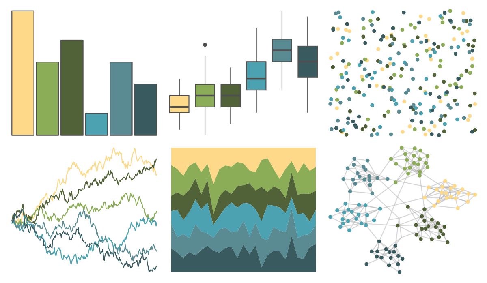
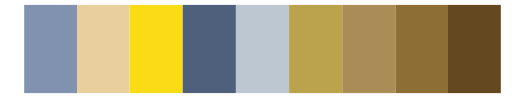

# calecopal - sierra2 

::: columns
::: {.column width="50%"}

**Github**

[an-bui/calecopal](https://github.com/an-bui/calecopal)
:::

::: {.column width="50%"}

**CRAN**

Not on CRAN
:::
:::

<hr> 

Use with [paletteer](https://emilhvitfeldt.github.io/paletteer/) package:

```r
library(paletteer)
paletteer_d("calecopal::sierra2")
```

Use raw:

```r
c("#FDD989FF", "#8BAD57FF", "#516238FF", "#4CA2B0FF", "#5A8B92FF", "#395B5FFF")
``` 

 

<br>

# Related Palettes

<div class="list" style="display: grid; grid-template-columns: auto auto auto;"> <figure class="figure">
<a href="../../awtools/a_palette/"> </a>
</figure> <figure class="figure">
<a href="../../PNWColors/Cascades/"> </a>
</figure> <figure class="figure">
<a href="../../MetBrewer/Derain/"> </a>
</figure> <figure class="figure">
<a href="../../ggthemes/Nuriel_Stone/"> </a>
</figure> <figure class="figure">
<a href="../../colRoz/r_aculeatus/"> </a>
</figure> <figure class="figure">
<a href="../../calecopal/seagrass/"> </a>
</figure> <figure class="figure">
<a href="../../fishualize/Thunnus_obesus/"> </a>
</figure> <figure class="figure">
<a href="../../peRReo/rosalia/"> </a>
</figure> <figure class="figure">
<a href="../../ggprism/quiet2/"> </a>
</figure> <figure class="figure">
<a href="../../calecopal/bigsur2/"> </a>
</figure> <figure class="figure">
<a href="../../lisa/VincentvanGogh_1/"> </a>
</figure> <figure class="figure">
<a href="../../lisa/WassilyKandinsky/"> </a>
</figure> 
</div>
