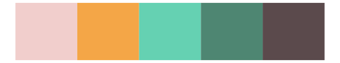

# calecopal - superbloom1 

::: columns
::: {.column width="50%"}

**Github**

[an-bui/calecopal](https://github.com/an-bui/calecopal)
:::

::: {.column width="50%"}

**CRAN**

Not on CRAN
:::
:::

<hr> 

Use with [paletteer](https://emilhvitfeldt.github.io/paletteer/) package:

```r
library(paletteer)
paletteer_d("calecopal::superbloom1")
```

Use raw:

```r
c("#B9C7E2FF", "#ECAB99FF", "#F1C100FF", "#5B6530FF", "#9484B1FF")
``` 

 

<br>

# Related Palettes

<div class="list" style="display: grid; grid-template-columns: auto auto auto;"> <figure class="figure">
<a href="../../awtools/a_palette/"> </a>
</figure> <figure class="figure">
<a href="../../tayloRswift/lover/"> </a>
</figure> <figure class="figure">
<a href="../../Redmonder/qMSOPap/"> </a>
</figure> <figure class="figure">
<a href="../../ochRe/olsen_qual/"> </a>
</figure> <figure class="figure">
<a href="../../fishualize/Halichoeres_radiatus/"> </a>
</figure> <figure class="figure">
<a href="../../lisa/HelenFrankenthaler/"> </a>
</figure> <figure class="figure">
<a href="../../nationalparkcolors/BlueRidgePkwy/"> </a>
</figure> <figure class="figure">
<a href="../../nationalparkcolors/Everglades/"> </a>
</figure> <figure class="figure">
<a href="../../lisa/PabloPicasso_1/"> </a>
</figure> <figure class="figure">
<a href="../../rtist/picasso/"> </a>
</figure> <figure class="figure">
<a href="../../feathers/rose_crowned_fruit_dove/"> </a>
</figure> <figure class="figure">
<a href="../../rtist/raphael/"> </a>
</figure> 
</div>
