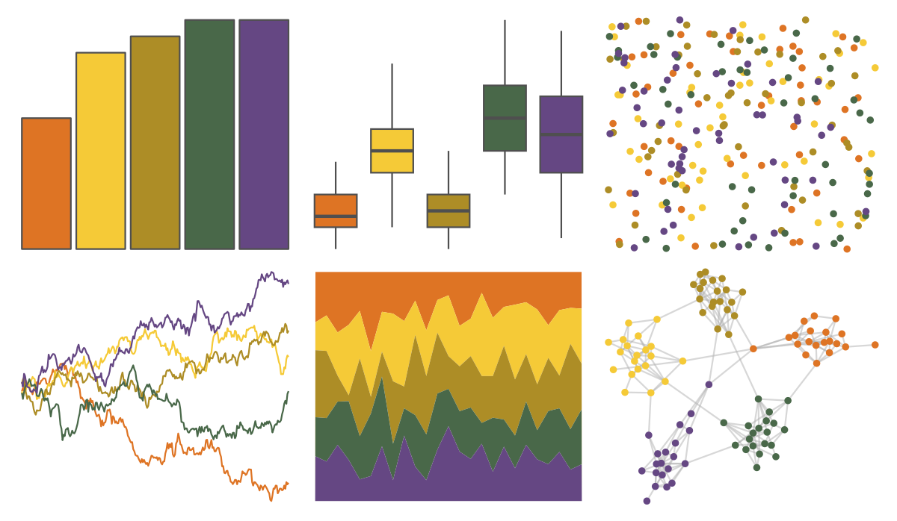

# calecopal - superbloom2 

::: columns
::: {.column width="50%"}

**Github**

[an-bui/calecopal](https://github.com/an-bui/calecopal)
:::

::: {.column width="50%"}

**CRAN**

Not on CRAN
:::
:::

<hr> 

Use with [paletteer](https://emilhvitfeldt.github.io/paletteer/) package:

```r
library(paletteer)
paletteer_d("calecopal::superbloom2")
```

Use raw:

```r
c("#DE7424FF", "#F5CA37FF", "#AD8D26FF", "#496849FF", "#654783FF")
``` 

 

<br>

# Related Palettes

<div class="list" style="display: grid; grid-template-columns: auto auto auto;"> <figure class="figure">
<a href="../../amerika/Dem_Ind_Rep3/"> </a>
</figure> <figure class="figure">
<a href="../../lisa/RobertDelaunay/"> </a>
</figure> <figure class="figure">
<a href="../../ggthemes/excel_Organic/"> </a>
</figure> <figure class="figure">
<a href="../../ochRe/lorikeet/"> </a>
</figure> <figure class="figure">
<a href="../../lisa/PaulGauguin/"> </a>
</figure> <figure class="figure">
<a href="../../lisa/PabloPicasso_1/"> </a>
</figure> <figure class="figure">
<a href="../../rtist/picasso/"> </a>
</figure> <figure class="figure">
<a href="../../lisa/GeneDavis/"> </a>
</figure> <figure class="figure">
<a href="../../lisa/MelRamos/"> </a>
</figure> <figure class="figure">
<a href="../../fishualize/Ctenochaetus_strigosus/"> </a>
</figure> <figure class="figure">
<a href="../../ggthemes/excel_Marquee/"> </a>
</figure> <figure class="figure">
<a href="../../ggthemes/excel_Office_Theme/"> </a>
</figure> 
</div>
