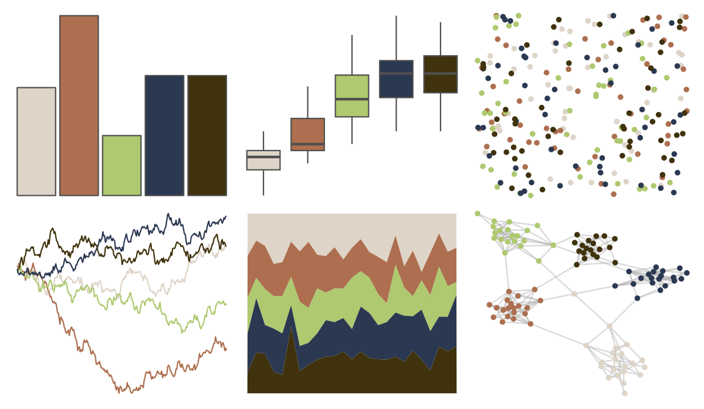

# calecopal - wetland 

::: columns
::: {.column width="50%"}

**Github**

[an-bui/calecopal](https://github.com/an-bui/calecopal)
:::

::: {.column width="50%"}

**CRAN**

Not on CRAN
:::
:::

<hr> 

Use with [paletteer](https://emilhvitfeldt.github.io/paletteer/) package:

```r
library(paletteer)
paletteer_d("calecopal::wetland")
```

Use raw:

```r
c("#DED4C8FF", "#AD6F4FFF", "#AEC96FFF", "#2B3851FF", "#3F320DFF")
``` 

 

<br>

# Related Palettes

<div class="list" style="display: grid; grid-template-columns: auto auto auto;"> <figure class="figure">
<a href="../../awtools/a_palette/"> </a>
</figure> <figure class="figure">
<a href="../../ButterflyColors/hamadryas_feronia/"> </a>
</figure> <figure class="figure">
<a href="../../ButterflyColors/hamadryas_feronia/"> </a>
</figure> <figure class="figure">
<a href="../../lisa/HilmaafKlint/"> </a>
</figure> <figure class="figure">
<a href="../../lisa/JacksonPollock/"> </a>
</figure> <figure class="figure">
<a href="../../rtist/pollock/"> </a>
</figure> <figure class="figure">
<a href="../../fishualize/Salmo_trutta/"> </a>
</figure> <figure class="figure">
<a href="../../lisa/TheovanDoesburg_1/"> </a>
</figure> <figure class="figure">
<a href="../../wesanderson/Moonrise2/"> </a>
</figure> <figure class="figure">
<a href="../../ggthemr/grass/"> </a>
</figure> <figure class="figure">
<a href="../../Manu/Takapu/"> </a>
</figure> <figure class="figure">
<a href="../../vangogh/Cypresses/"> </a>
</figure> 
</div>
