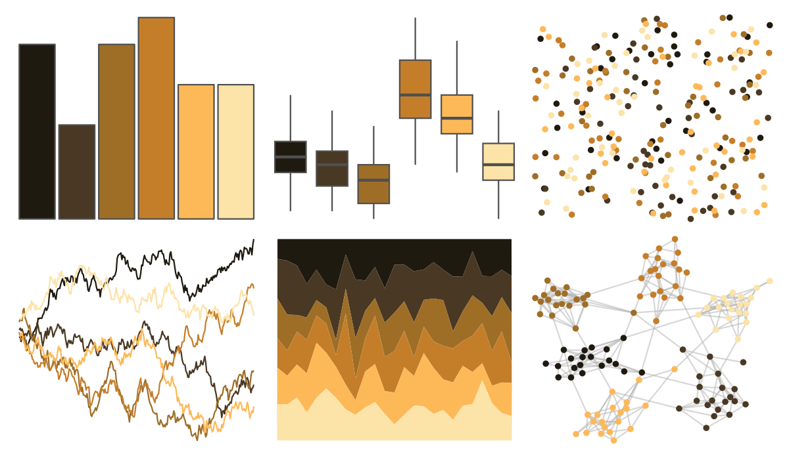

# colRoz - a_plagiata 

::: columns
::: {.column width="50%"}

**Github**

[jacintak/colRoz](https://github.com/jacintak/colRoz)
:::

::: {.column width="50%"}

**CRAN**

Not on CRAN
:::
:::

<hr> 

Use with [paletteer](https://emilhvitfeldt.github.io/paletteer/) package:

```r
library(paletteer)
paletteer_d("colRoz::a_plagiata")
```

Use raw:

```r
c("#1F1A10FF", "#493823FF", "#9E6E27FF", "#C47E2AFF", "#FDB958FF", "#FCE3A8FF")
``` 

 

<br>

# Related Palettes

<div class="list" style="display: grid; grid-template-columns: auto auto auto;"> <figure class="figure">
<a href="../../awtools/a_palette/"> </a>
</figure> <figure class="figure">
<a href="../../ButterflyColors/hamadryas_feronia/"> </a>
</figure> <figure class="figure">
<a href="../../ButterflyColors/hamadryas_feronia/"> </a>
</figure> <figure class="figure">
<a href="../../beyonce/X16/"> </a>
</figure> <figure class="figure">
<a href="../../soilpalettes/natrudoll/"> </a>
</figure> <figure class="figure">
<a href="../../beyonce/X86/"> </a>
</figure> <figure class="figure">
<a href="../../colRoz/a_westwoodi/"> </a>
</figure> <figure class="figure">
<a href="../../colRoz/a_ramsayi/"> </a>
</figure> <figure class="figure">
<a href="../../soilpalettes/durorthod/"> </a>
</figure> <figure class="figure">
<a href="../../palettetown/swinub/"> </a>
</figure> <figure class="figure">
<a href="../../PNWColors/Mushroom/"> </a>
</figure> <figure class="figure">
<a href="../../beyonce/X59/"> </a>
</figure> 
</div>
