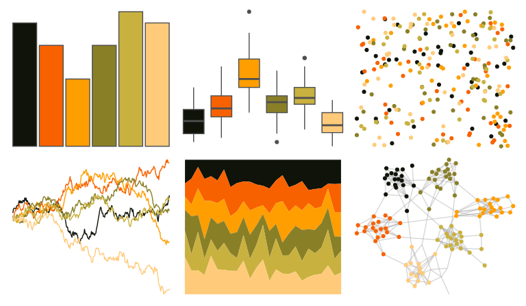

# colRoz - a_westwoodi 

::: columns
::: {.column width="50%"}

**Github**

[jacintak/colRoz](https://github.com/jacintak/colRoz)
:::

::: {.column width="50%"}

**CRAN**

Not on CRAN
:::
:::

<hr> 

Use with [paletteer](https://emilhvitfeldt.github.io/paletteer/) package:

```r
library(paletteer)
paletteer_d("colRoz::a_westwoodi")
```

Use raw:

```r
c("#0F1309FF", "#F86100FF", "#FF9E00FF", "#897F27FF", "#C9B13FFF", "#FFCB7BFF")
``` 

 

<br>

# Related Palettes

<div class="list" style="display: grid; grid-template-columns: auto auto auto;"> <figure class="figure">
<a href="../../awtools/a_palette/"> </a>
</figure> <figure class="figure">
<a href="../../colRoz/a_plagiata/"> </a>
</figure> <figure class="figure">
<a href="../../soilpalettes/natrudoll/"> </a>
</figure> <figure class="figure">
<a href="../../palettetown/swinub/"> </a>
</figure> <figure class="figure">
<a href="../../beyonce/X16/"> </a>
</figure> <figure class="figure">
<a href="../../NineteenEightyR/seventies_aint_done_yet/"> </a>
</figure> <figure class="figure">
<a href="../../MetBrewer/Homer2/"> </a>
</figure> <figure class="figure">
<a href="../../soilpalettes/durorthod/"> </a>
</figure> <figure class="figure">
<a href="../../beyonce/X86/"> </a>
</figure> <figure class="figure">
<a href="../../beyonce/X59/"> </a>
</figure> <figure class="figure">
<a href="../../lisa/FridaKahlo/"> </a>
</figure> <figure class="figure">
<a href="../../PNWColors/Mushroom/"> </a>
</figure> 
</div>
