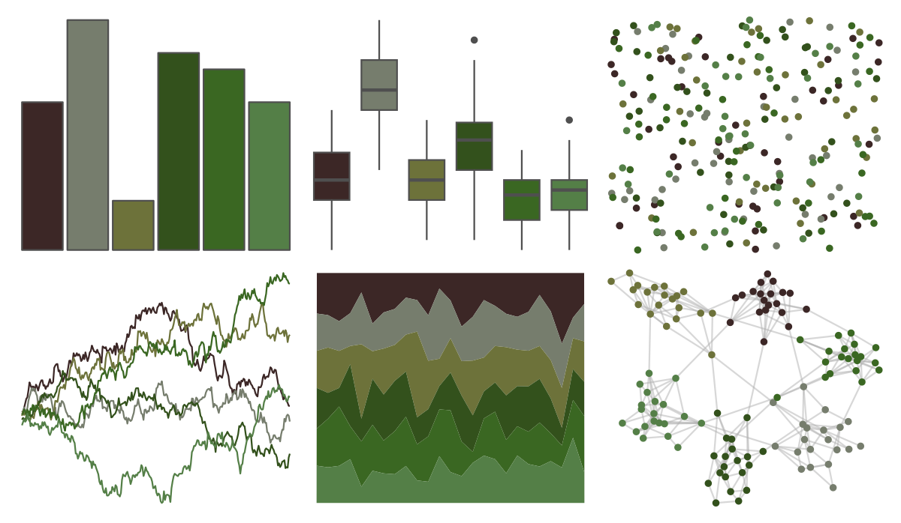

# colRoz - c_australasiae 

::: columns
::: {.column width="50%"}

**Github**

[jacintak/colRoz](https://github.com/jacintak/colRoz)
:::

::: {.column width="50%"}

**CRAN**

Not on CRAN
:::
:::

<hr> 

Use with [paletteer](https://emilhvitfeldt.github.io/paletteer/) package:

```r
library(paletteer)
paletteer_d("colRoz::c_australasiae")
```

Use raw:

```r
c("#3C2726FF", "#767D6DFF", "#6D723AFF", "#33511CFF", "#3A6722FF", "#547F47FF")
``` 

 

<br>

# Related Palettes

<div class="list" style="display: grid; grid-template-columns: auto auto auto;"> <figure class="figure">
<a href="../../amerika/Dem_Ind_Rep3/"> </a>
</figure> <figure class="figure">
<a href="../../calecopal/redwood1/"> </a>
</figure> <figure class="figure">
<a href="../../colRoz/a_conica/"> </a>
</figure> <figure class="figure">
<a href="../../fishualize/Micropterus_punctulatus/"> </a>
</figure> <figure class="figure">
<a href="../../yarrr/evildead/"> </a>
</figure> <figure class="figure">
<a href="../../werpals/monet/"> </a>
</figure> <figure class="figure">
<a href="../../ButterflyColors/dynamine_postverta/"> </a>
</figure> <figure class="figure">
<a href="../../ochRe/jumping_frog/"> </a>
</figure> <figure class="figure">
<a href="../../beyonce/X42/"> </a>
</figure> <figure class="figure">
<a href="../../ghibli/MarnieMedium2/"> </a>
</figure> <figure class="figure">
<a href="../../lisa/ClaudeMonet/"> </a>
</figure> <figure class="figure">
<a href="../../ggprism/earth_tones/"> </a>
</figure> 
</div>
