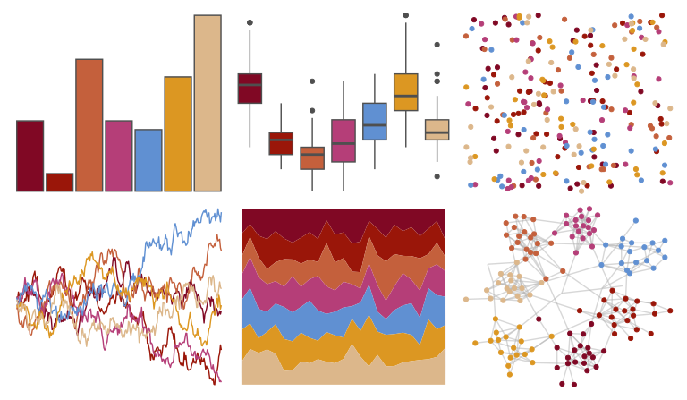
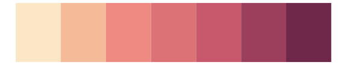
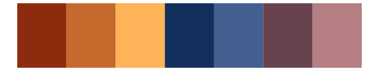
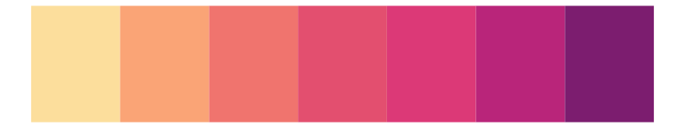
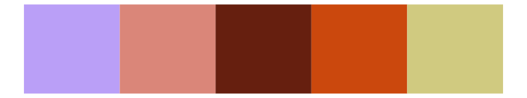

# colRoz - c_brevi 

::: columns
::: {.column width="50%"}

**Github**

[jacintak/colRoz](https://github.com/jacintak/colRoz)
:::

::: {.column width="50%"}

**CRAN**

Not on CRAN
:::
:::

<hr> 

Use with [paletteer](https://emilhvitfeldt.github.io/paletteer/) package:

```r
library(paletteer)
paletteer_d("colRoz::c_brevi")
```

Use raw:

```r
c("#800824FF", "#9A1609FF", "#C4603CFF", "#B53E78FF", "#6090D2FF", "#DC9722FF", "#DCB78BFF")
``` 

 

<br>

# Related Palettes

<div class="list" style="display: grid; grid-template-columns: auto auto auto;"> <figure class="figure">
<a href="../../awtools/a_palette/"> </a>
</figure> <figure class="figure">
<a href="../../colRoz/grandis/"> </a>
</figure> <figure class="figure">
<a href="../../ggthemes/Classic_Blue_Red_6/"> </a>
</figure> <figure class="figure">
<a href="../../PNWColors/Sunset2/"> </a>
</figure> <figure class="figure">
<a href="../../rcartocolor/BurgYl/"> </a>
</figure> <figure class="figure">
<a href="../../NineteenEightyR/sunset1/"> </a>
</figure> <figure class="figure">
<a href="../../MetBrewer/Java/"> </a>
</figure> <figure class="figure">
<a href="../../NatParksPalettes/DeathValley/"> </a>
</figure> <figure class="figure">
<a href="../../rcartocolor/SunsetDark/"> </a>
</figure> <figure class="figure">
<a href="../../fishualize/Nemateleotris_magnifica/"> </a>
</figure> <figure class="figure">
<a href="../../NatParksPalettes/BryceCanyon/"> </a>
</figure> <figure class="figure">
<a href="../../fishualize/Clepticus_brasiliensis/"> </a>
</figure> 
</div>
