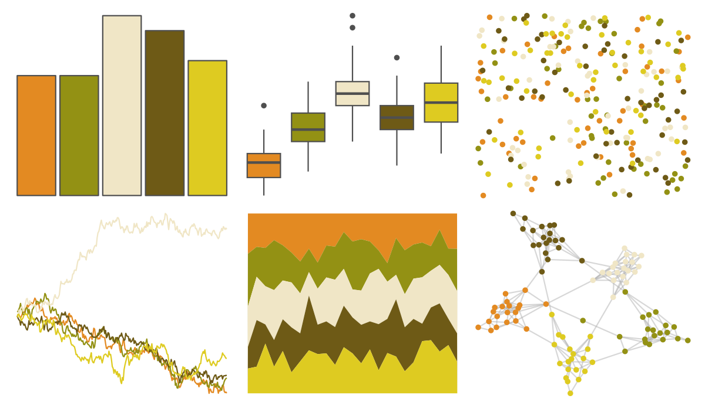

# colRoz - c_kingii 

::: columns
::: {.column width="50%"}

**Github**

[jacintak/colRoz](https://github.com/jacintak/colRoz)
:::

::: {.column width="50%"}

**CRAN**

Not on CRAN
:::
:::

<hr> 

Use with [paletteer](https://emilhvitfeldt.github.io/paletteer/) package:

```r
library(paletteer)
paletteer_d("colRoz::c_kingii")
```

Use raw:

```r
c("#E38A22FF", "#939114FF", "#F0E6C6FF", "#6E5A16FF", "#DECB21FF")
``` 

 

<br>

# Related Palettes

<div class="list" style="display: grid; grid-template-columns: auto auto auto;"> <figure class="figure">
<a href="../../amerika/Dem_Ind_Rep3/"> </a>
</figure> <figure class="figure">
<a href="../../Manu/Kakapo/"> </a>
</figure> <figure class="figure">
<a href="../../lisa/RemediosVaro/"> </a>
</figure> <figure class="figure">
<a href="../../fishualize/Chormis_multilineata/"> </a>
</figure> <figure class="figure">
<a href="../../palettetown/abra/"> </a>
</figure> <figure class="figure">
<a href="../../poisonfrogs/Pterribilis/"> </a>
</figure> <figure class="figure">
<a href="../../tayloRswift/fearlessTV/"> </a>
</figure> <figure class="figure">
<a href="../../palettetown/diglett/"> </a>
</figure> <figure class="figure">
<a href="../../NatParksPalettes/Olympic/"> </a>
</figure> <figure class="figure">
<a href="../../waRhol/skull_76_1/"> </a>
</figure> <figure class="figure">
<a href="../../ggprism/mustard_field2/"> </a>
</figure> <figure class="figure">
<a href="../../calecopal/oak/"> </a>
</figure> 
</div>
