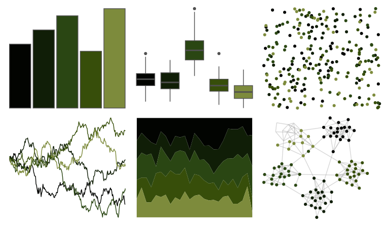

# colRoz - daintree 

::: columns
::: {.column width="50%"}

**Github**

[jacintak/colRoz](https://github.com/jacintak/colRoz)
:::

::: {.column width="50%"}

**CRAN**

Not on CRAN
:::
:::

<hr> 

Use with [paletteer](https://emilhvitfeldt.github.io/paletteer/) package:

```r
library(paletteer)
paletteer_d("colRoz::daintree")
```

Use raw:

```r
c("#020401FF", "#101E07FF", "#2A4613FF", "#374E0AFF", "#7D8B3CFF")
``` 

 

<br>

# Related Palettes

<div class="list" style="display: grid; grid-template-columns: auto auto auto;"> <figure class="figure">
<a href="../../awtools/a_palette/"> </a>
</figure> <figure class="figure">
<a href="../../yarrr/evildead/"> </a>
</figure> <figure class="figure">
<a href="../../ghibli/MarnieDark2/"> </a>
</figure> <figure class="figure">
<a href="../../colRoz/c_australasiae/"> </a>
</figure> <figure class="figure">
<a href="../../fishualize/Acanthostracion_polygonius/"> </a>
</figure> <figure class="figure">
<a href="../../werpals/monet/"> </a>
</figure> <figure class="figure">
<a href="../../fishualize/Micropterus_punctulatus/"> </a>
</figure> <figure class="figure">
<a href="../../colRoz/l_boydii/"> </a>
</figure> <figure class="figure">
<a href="../../calecopal/redwood2/"> </a>
</figure> <figure class="figure">
<a href="../../nbapalettes/celtics_champ/"> </a>
</figure> <figure class="figure">
<a href="../../colRoz/a_conica/"> </a>
</figure> <figure class="figure">
<a href="../../rtist/davinci/"> </a>
</figure> 
</div>
