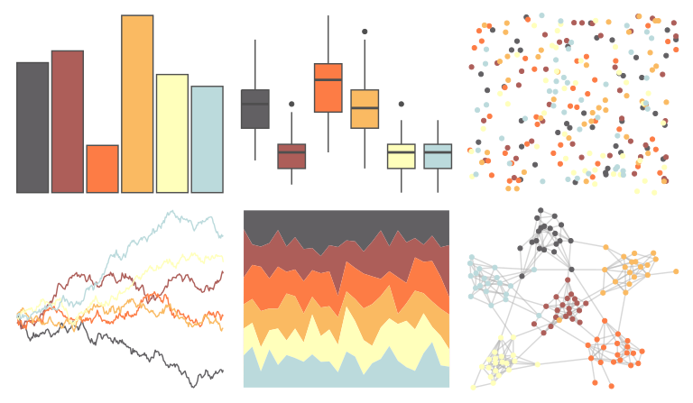

# colRoz - desert_sunset 

::: columns
::: {.column width="50%"}

**Github**

[jacintak/colRoz](https://github.com/jacintak/colRoz)
:::

::: {.column width="50%"}

**CRAN**

Not on CRAN
:::
:::

<hr> 

Use with [paletteer](https://emilhvitfeldt.github.io/paletteer/) package:

```r
library(paletteer)
paletteer_d("colRoz::desert_sunset")
```

Use raw:

```r
c("#626063FF", "#AD5E59FF", "#FD7C45FF", "#FABA62FF", "#FFFFBBFF", "#BBDADCFF")
``` 

 

<br>

# Related Palettes

<div class="list" style="display: grid; grid-template-columns: auto auto auto;"> <figure class="figure">
<a href="../../awtools/a_palette/"> </a>
</figure> <figure class="figure">
<a href="../../Redmonder/qMSOMrq/"> </a>
</figure> <figure class="figure">
<a href="../../wesanderson/Royal1/"> </a>
</figure> <figure class="figure">
<a href="../../rcartocolor/Geyser/"> </a>
</figure> <figure class="figure">
<a href="../../nationalparkcolors/Redwoods/"> </a>
</figure> <figure class="figure">
<a href="../../beyonce/X32/"> </a>
</figure> <figure class="figure">
<a href="../../palettetown/magby/"> </a>
</figure> <figure class="figure">
<a href="../../ggthemes/few_Light/"> </a>
</figure> <figure class="figure">
<a href="../../PNWColors/Shuksan2/"> </a>
</figure> <figure class="figure">
<a href="../../nationalparkcolors/Badlands/"> </a>
</figure> <figure class="figure">
<a href="../../MapPalettes/sunset/"> </a>
</figure> <figure class="figure">
<a href="../../calecopal/chaparral1/"> </a>
</figure> 
</div>
