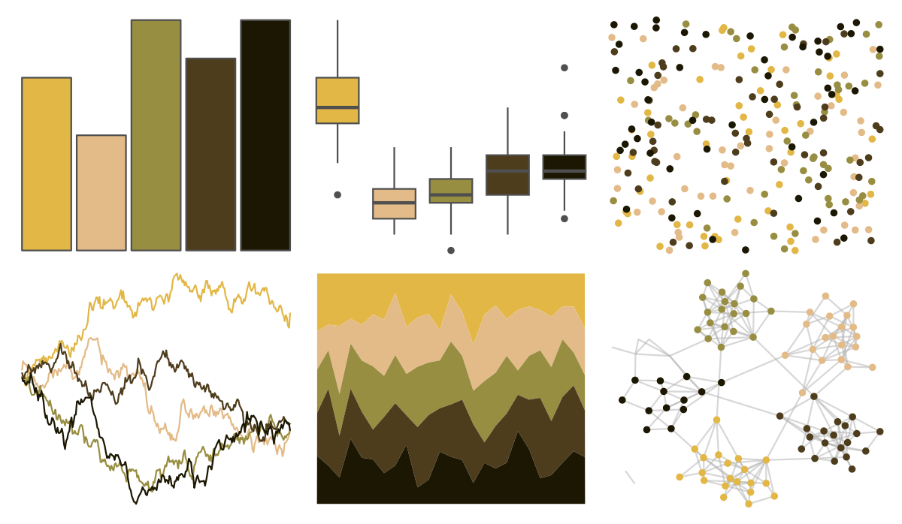

# colRoz - e_leuraensis 

::: columns
::: {.column width="50%"}

**Github**

[jacintak/colRoz](https://github.com/jacintak/colRoz)
:::

::: {.column width="50%"}

**CRAN**

Not on CRAN
:::
:::

<hr> 

Use with [paletteer](https://emilhvitfeldt.github.io/paletteer/) package:

```r
library(paletteer)
paletteer_d("colRoz::e_leuraensis")
```

Use raw:

```r
c("#E2B745FF", "#E3BB88FF", "#988E42FF", "#4E3D1DFF", "#1B1702FF")
``` 

 

<br>

# Related Palettes

<div class="list" style="display: grid; grid-template-columns: auto auto auto;"> <figure class="figure">
<a href="../../amerika/Dem_Ind_Rep3/"> </a>
</figure> <figure class="figure">
<a href="../../lisa/Rembrandt/"> </a>
</figure> <figure class="figure">
<a href="../../poisonfrogs/Ptomopterna/"> </a>
</figure> <figure class="figure">
<a href="../../DresdenColor/smallfavor/"> </a>
</figure> <figure class="figure">
<a href="../../colRoz/m_horridus2/"> </a>
</figure> <figure class="figure">
<a href="../../DresdenColor/summerknight/"> </a>
</figure> <figure class="figure">
<a href="../../ButterflyColors/anteos_menippe/"> </a>
</figure> <figure class="figure">
<a href="../../DresdenColor/sidejobs/"> </a>
</figure> <figure class="figure">
<a href="../../poisonfrogs/Hcinerascens/"> </a>
</figure> <figure class="figure">
<a href="../../wesanderson/Moonrise1/"> </a>
</figure> <figure class="figure">
<a href="../../colRoz/t_nigrolutea/"> </a>
</figure> <figure class="figure">
<a href="../../poisonfrogs/Opcolon/"> </a>
</figure> 
</div>
