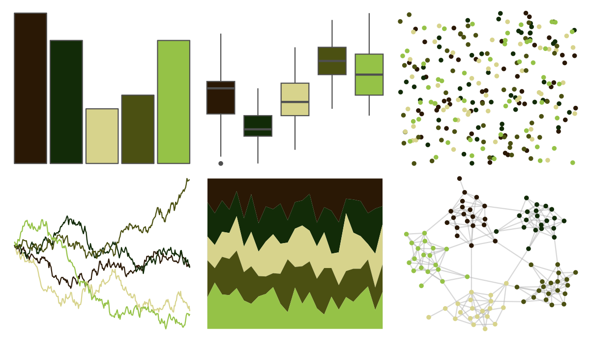

# colRoz - l_boydii 

::: columns
::: {.column width="50%"}

**Github**

[jacintak/colRoz](https://github.com/jacintak/colRoz)
:::

::: {.column width="50%"}

**CRAN**

Not on CRAN
:::
:::

<hr> 

Use with [paletteer](https://emilhvitfeldt.github.io/paletteer/) package:

```r
library(paletteer)
paletteer_d("colRoz::l_boydii")
```

Use raw:

```r
c("#2A1805FF", "#122B08FF", "#D7D38CFF", "#4B5012FF", "#95C247FF")
``` 

 

<br>

# Related Palettes

<div class="list" style="display: grid; grid-template-columns: auto auto auto;"> <figure class="figure">
<a href="../../awtools/a_palette/"> </a>
</figure> <figure class="figure">
<a href="../../werpals/monet/"> </a>
</figure> <figure class="figure">
<a href="../../colRoz/k_scurra/"> </a>
</figure> <figure class="figure">
<a href="../../MetBrewer/VanGogh3/"> </a>
</figure> <figure class="figure">
<a href="../../fishualize/Antennarius_multiocellatus/"> </a>
</figure> <figure class="figure">
<a href="../../colRoz/a_ramsayi/"> </a>
</figure> <figure class="figure">
<a href="../../fishualize/Ostracion_cubicus/"> </a>
</figure> <figure class="figure">
<a href="../../ghibli/MarnieMedium2/"> </a>
</figure> <figure class="figure">
<a href="../../fishualize/Acanthurus_triostegus/"> </a>
</figure> <figure class="figure">
<a href="../../fishualize/Thalassoma_pavo/"> </a>
</figure> <figure class="figure">
<a href="../../rtist/davinci/"> </a>
</figure> <figure class="figure">
<a href="../../tvthemes/EarthKingdom/"> </a>
</figure> 
</div>
