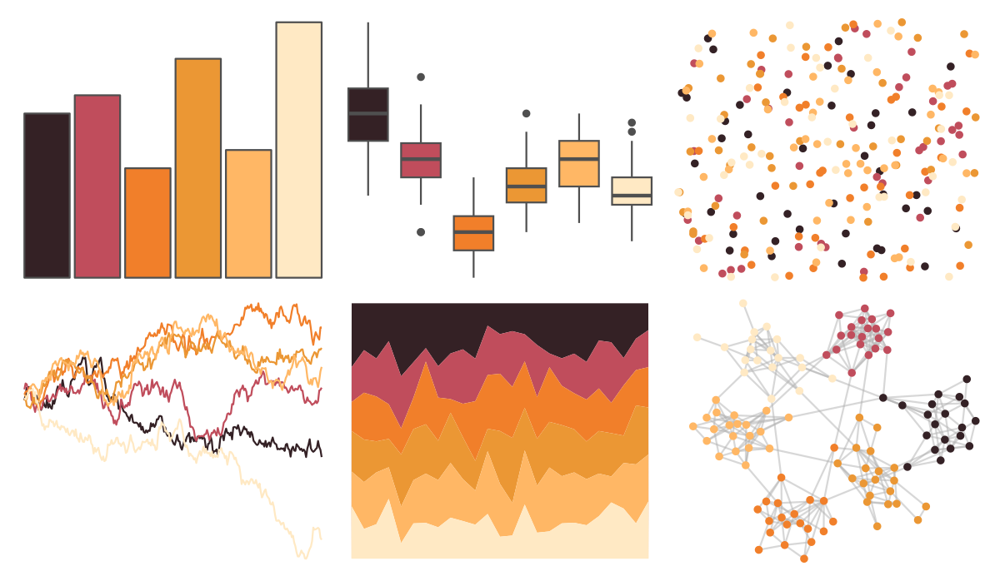

# colRoz - l_vestiens 

::: columns
::: {.column width="50%"}

**Github**

[jacintak/colRoz](https://github.com/jacintak/colRoz)
:::

::: {.column width="50%"}

**CRAN**

Not on CRAN
:::
:::

<hr> 

Use with [paletteer](https://emilhvitfeldt.github.io/paletteer/) package:

```r
library(paletteer)
paletteer_d("colRoz::l_vestiens")
```

Use raw:

```r
c("#342125FF", "#C04D5CFF", "#F17F2AFF", "#EB9734FF", "#FFB765FF", "#FFE9C4FF")
``` 

 

<br>

# Related Palettes

<div class="list" style="display: grid; grid-template-columns: auto auto auto;"> <figure class="figure">
<a href="../../amerika/Dem_Ind_Rep3/"> </a>
</figure> <figure class="figure">
<a href="../../beyonce/X58/"> </a>
</figure> <figure class="figure">
<a href="../../Redmonder/qMSOYl/"> </a>
</figure> <figure class="figure">
<a href="../../DresdenColor/skingame/"> </a>
</figure> <figure class="figure">
<a href="../../colRoz/flavolineata/"> </a>
</figure> <figure class="figure">
<a href="../../beyonce/X32/"> </a>
</figure> <figure class="figure">
<a href="../../trekcolors/tholian/"> </a>
</figure> <figure class="figure">
<a href="../../lisa/SandroBotticelli_1/"> </a>
</figure> <figure class="figure">
<a href="../../colRoz/ngadju/"> </a>
</figure> <figure class="figure">
<a href="../../vapoRwave/jwz/"> </a>
</figure> <figure class="figure">
<a href="../../lisa/ReneMagritte/"> </a>
</figure> <figure class="figure">
<a href="../../trekcolors/breen2/"> </a>
</figure> 
</div>
