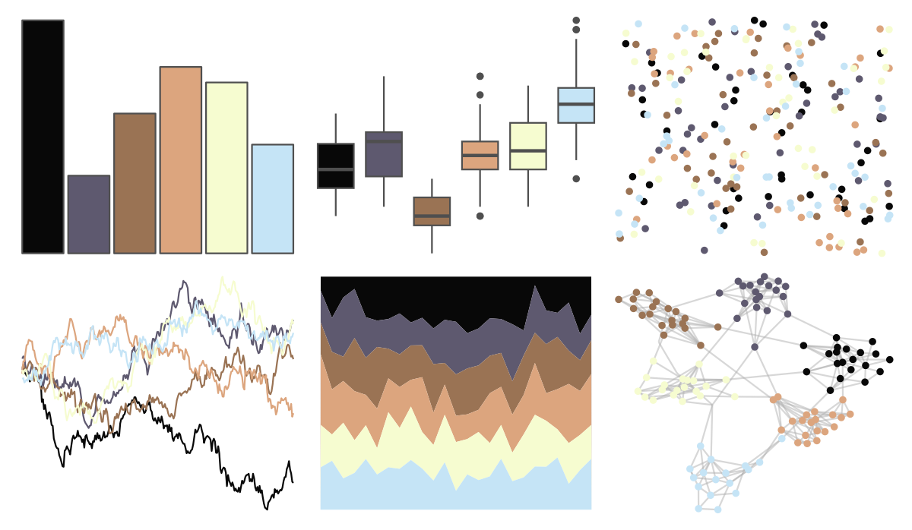

# colRoz - n_levis 

::: columns
::: {.column width="50%"}

**Github**

[jacintak/colRoz](https://github.com/jacintak/colRoz)
:::

::: {.column width="50%"}

**CRAN**

Not on CRAN
:::
:::

<hr> 

Use with [paletteer](https://emilhvitfeldt.github.io/paletteer/) package:

```r
library(paletteer)
paletteer_d("colRoz::n_levis")
```

Use raw:

```r
c("#080808FF", "#5E596FFF", "#9A7354FF", "#DCA57EFF", "#F6FCD0FF", "#C5E4F6FF")
``` 

 

<br>

# Related Palettes

<div class="list" style="display: grid; grid-template-columns: auto auto auto;"> <figure class="figure">
<a href="../../awtools/a_palette/"> </a>
</figure> <figure class="figure">
<a href="../../fishualize/Chaetodon_larvatus/"> </a>
</figure> <figure class="figure">
<a href="../../tayloRswift/speakNow/"> </a>
</figure> <figure class="figure">
<a href="../../ggsci/signature_substitutions_cosmic/"> </a>
</figure> <figure class="figure">
<a href="../../fishualize/Naso_lituratus/"> </a>
</figure> <figure class="figure">
<a href="../../lisa/JoanMiro/"> </a>
</figure> <figure class="figure">
<a href="../../Manu/Hihi/"> </a>
</figure> <figure class="figure">
<a href="../../ggprism/pearl2/"> </a>
</figure> <figure class="figure">
<a href="../../nbapalettes/grizzlies_europe/"> </a>
</figure> <figure class="figure">
<a href="../../lisa/SandroBotticelli_1/"> </a>
</figure> <figure class="figure">
<a href="../../tvthemes/Greyjoy/"> </a>
</figure> <figure class="figure">
<a href="../../tvthemes/Topaz/"> </a>
</figure> 
</div>
