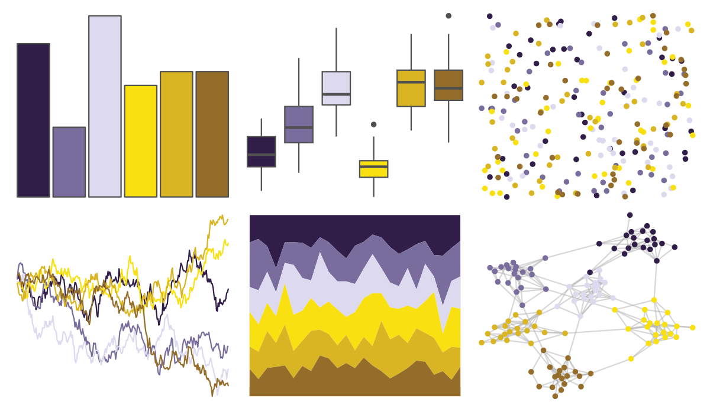

# colRoz - n_violacea 

::: columns
::: {.column width="50%"}

**Github**

[jacintak/colRoz](https://github.com/jacintak/colRoz)
:::

::: {.column width="50%"}

**CRAN**

Not on CRAN
:::
:::

<hr> 

Use with [paletteer](https://emilhvitfeldt.github.io/paletteer/) package:

```r
library(paletteer)
paletteer_d("colRoz::n_violacea")
```

Use raw:

```r
c("#301E48FF", "#796D9DFF", "#DDDAEFFF", "#F9E011FF", "#D9B523FF", "#946D2AFF")
``` 

 

<br>

# Related Palettes

<div class="list" style="display: grid; grid-template-columns: auto auto auto;"> <figure class="figure">
<a href="../../awtools/a_palette/"> </a>
</figure> <figure class="figure">
<a href="../../Manu/Hihi/"> </a>
</figure> <figure class="figure">
<a href="../../fishualize/Melichthys_vidua/"> </a>
</figure> <figure class="figure">
<a href="../../fishualize/Naso_lituratus/"> </a>
</figure> <figure class="figure">
<a href="../../palettetown/jolteon/"> </a>
</figure> <figure class="figure">
<a href="../../lisa/JoanMiro/"> </a>
</figure> <figure class="figure">
<a href="../../LaCroixColoR/CeriseLimon/"> </a>
</figure> <figure class="figure">
<a href="../../Redmonder/dPBIYlPu/"> </a>
</figure> <figure class="figure">
<a href="../../tvthemes/Greyjoy/"> </a>
</figure> <figure class="figure">
<a href="../../nationalparkcolors/BlueRidgePkwy/"> </a>
</figure> <figure class="figure">
<a href="../../feathers/rose_crowned_fruit_dove/"> </a>
</figure> <figure class="figure">
<a href="../../lisa/JohannesVermeer_1/"> </a>
</figure> 
</div>
