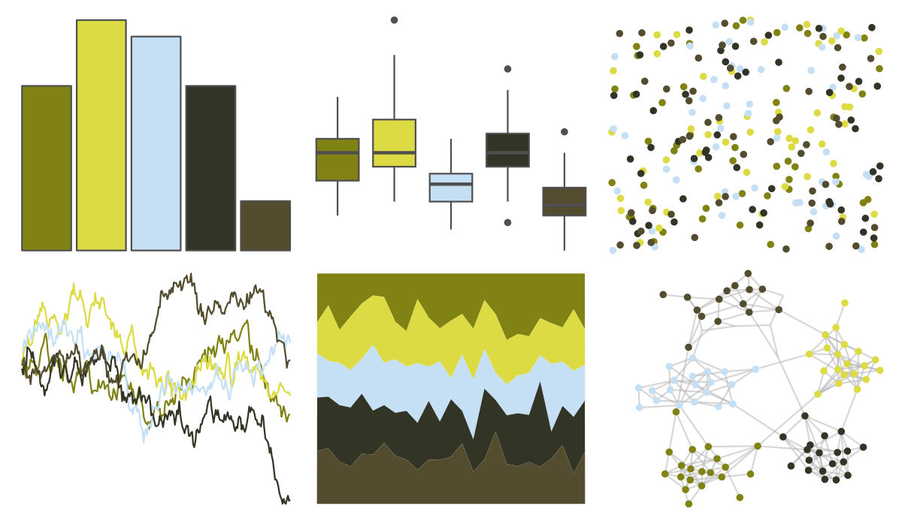

# colRoz - nq_stream 

::: columns
::: {.column width="50%"}

**Github**

[jacintak/colRoz](https://github.com/jacintak/colRoz)
:::

::: {.column width="50%"}

**CRAN**

Not on CRAN
:::
:::

<hr> 

Use with [paletteer](https://emilhvitfeldt.github.io/paletteer/) package:

```r
library(paletteer)
paletteer_d("colRoz::nq_stream")
```

Use raw:

```r
c("#808314FF", "#DCDB43FF", "#C5DFF4FF", "#323526FF", "#534C2EFF")
``` 

 

<br>

# Related Palettes

<div class="list" style="display: grid; grid-template-columns: auto auto auto;"> <figure class="figure">
<a href="../../amerika/Dem_Ind_Rep3/"> </a>
</figure> <figure class="figure">
<a href="../../wesanderson/Moonrise1/"> </a>
</figure> <figure class="figure">
<a href="../../fishualize/Prognathodes_guyanensis/"> </a>
</figure> <figure class="figure">
<a href="../../ggthemr/camouflage/"> </a>
</figure> <figure class="figure">
<a href="../../colRoz/p_mitchelli/"> </a>
</figure> <figure class="figure">
<a href="../../lisa/JohnSingerSargent_1/"> </a>
</figure> <figure class="figure">
<a href="../../DresdenColor/provenguilty/"> </a>
</figure> <figure class="figure">
<a href="../../MoMAColors/Liu/"> </a>
</figure> <figure class="figure">
<a href="../../wesanderson/Cavalcanti1/"> </a>
</figure> <figure class="figure">
<a href="../../tayloRswift/taylorSwift/"> </a>
</figure> <figure class="figure">
<a href="../../fishualize/Ostorhinchus_angustatus/"> </a>
</figure> <figure class="figure">
<a href="../../lisa/SandySkoglund/"> </a>
</figure> 
</div>
