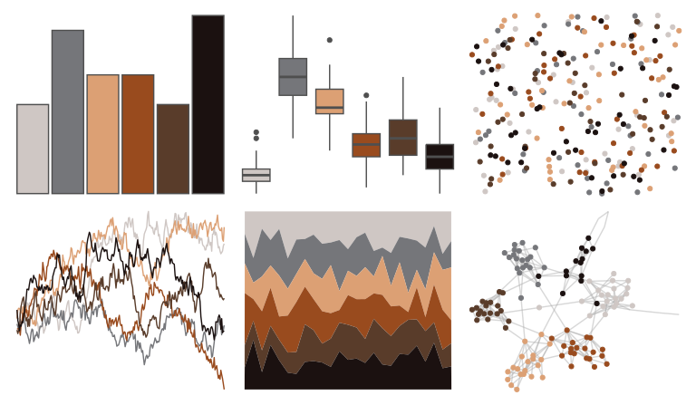

# colRoz - p_cincta 

::: columns
::: {.column width="50%"}

**Github**

[jacintak/colRoz](https://github.com/jacintak/colRoz)
:::

::: {.column width="50%"}

**CRAN**

Not on CRAN
:::
:::

<hr> 

Use with [paletteer](https://emilhvitfeldt.github.io/paletteer/) package:

```r
library(paletteer)
paletteer_d("colRoz::p_cincta")
```

Use raw:

```r
c("#CFC7C4FF", "#75767AFF", "#DCA074FF", "#994B1EFF", "#593C2AFF", "#1B1110FF")
``` 

 

<br>

# Related Palettes

<div class="list" style="display: grid; grid-template-columns: auto auto auto;"> <figure class="figure">
<a href="../../awtools/a_palette/"> </a>
</figure> <figure class="figure">
<a href="../../rtist/degas/"> </a>
</figure> <figure class="figure">
<a href="../../dutchmasters/anatomy/"> </a>
</figure> <figure class="figure">
<a href="../../tayloRswift/evermore/"> </a>
</figure> <figure class="figure">
<a href="../../calecopal/grassdry/"> </a>
</figure> <figure class="figure">
<a href="../../Manu/Takapu/"> </a>
</figure> <figure class="figure">
<a href="../../peRReo/don/"> </a>
</figure> <figure class="figure">
<a href="../../wesanderson/IsleofDogs1/"> </a>
</figure> <figure class="figure">
<a href="../../IslamicArt/alhambra/"> </a>
</figure> <figure class="figure">
<a href="../../lisa/LucianFreud/"> </a>
</figure> <figure class="figure">
<a href="../../colRoz/picta/"> </a>
</figure> <figure class="figure">
<a href="../../nationalparkcolors/Denali/"> </a>
</figure> 
</div>
