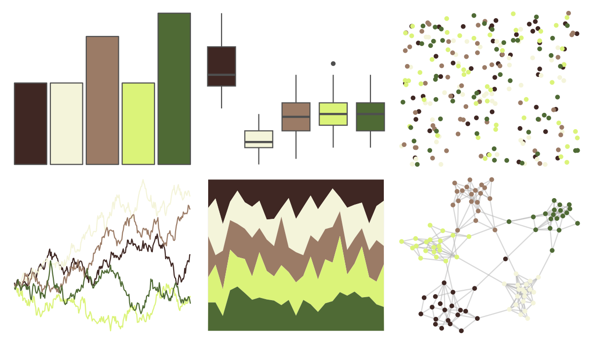

# colRoz - p_mitchelli 

::: columns
::: {.column width="50%"}

**Github**

[jacintak/colRoz](https://github.com/jacintak/colRoz)
:::

::: {.column width="50%"}

**CRAN**

Not on CRAN
:::
:::

<hr> 

Use with [paletteer](https://emilhvitfeldt.github.io/paletteer/) package:

```r
library(paletteer)
paletteer_d("colRoz::p_mitchelli")
```

Use raw:

```r
c("#3F2723FF", "#F4F4DAFF", "#9B7B66FF", "#DBF379FF", "#4F6A35FF")
``` 

 

<br>

# Related Palettes

<div class="list" style="display: grid; grid-template-columns: auto auto auto;"> <figure class="figure">
<a href="../../awtools/a_palette/"> </a>
</figure> <figure class="figure">
<a href="../../ButterflyColors/hamadryas_feronia/"> </a>
</figure> <figure class="figure">
<a href="../../ButterflyColors/hamadryas_feronia/"> </a>
</figure> <figure class="figure">
<a href="../../futurevisions/earth/"> </a>
</figure> <figure class="figure">
<a href="../../fishualize/Acanthurus_triostegus/"> </a>
</figure> <figure class="figure">
<a href="../../colRoz/s_spinigerus/"> </a>
</figure> <figure class="figure">
<a href="../../lisa/SandySkoglund/"> </a>
</figure> <figure class="figure">
<a href="../../werpals/pan/"> </a>
</figure> <figure class="figure">
<a href="../../fishualize/Melichthys_vidua/"> </a>
</figure> <figure class="figure">
<a href="../../feathers/eastern_rosella/"> </a>
</figure> <figure class="figure">
<a href="../../tayloRswift/taylorSwift/"> </a>
</figure> <figure class="figure">
<a href="../../lisa/MarcelDuchamp/"> </a>
</figure> 
</div>
