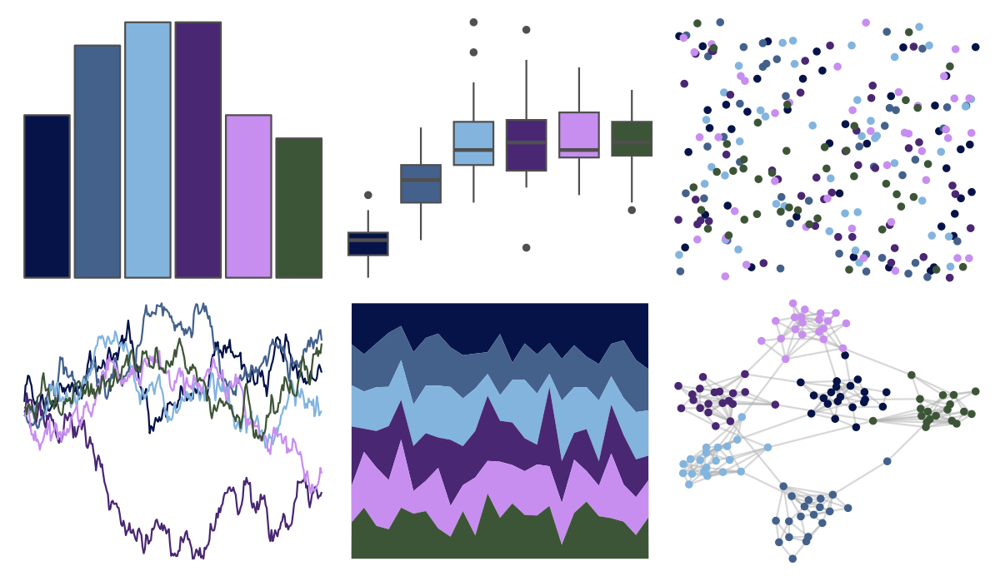

# colRoz - physalia 

::: columns
::: {.column width="50%"}

**Github**

[jacintak/colRoz](https://github.com/jacintak/colRoz)
:::

::: {.column width="50%"}

**CRAN**

Not on CRAN
:::
:::

<hr> 

Use with [paletteer](https://emilhvitfeldt.github.io/paletteer/) package:

```r
library(paletteer)
paletteer_d("colRoz::physalia")
```

Use raw:

```r
c("#061349FF", "#44618CFF", "#82B4DEFF", "#492772FF", "#C78EF0FF", "#3D5537FF")
``` 

 

<br>

# Related Palettes

<div class="list" style="display: grid; grid-template-columns: auto auto auto;"> <figure class="figure">
<a href="../../awtools/a_palette/"> </a>
</figure> <figure class="figure">
<a href="../../beyonce/X15/"> </a>
</figure> <figure class="figure">
<a href="../../calecopal/sbchannel/"> </a>
</figure> <figure class="figure">
<a href="../../yarrr/eternal/"> </a>
</figure> <figure class="figure">
<a href="../../NineteenEightyR/electronic_night/"> </a>
</figure> <figure class="figure">
<a href="../../tvthemes/Flourite/"> </a>
</figure> <figure class="figure">
<a href="../../fishualize/Acanthurus_chirurgus/"> </a>
</figure> <figure class="figure">
<a href="../../LaCroixColoR/Berry/"> </a>
</figure> <figure class="figure">
<a href="../../tvthemes/Sugilite/"> </a>
</figure> <figure class="figure">
<a href="../../nbapalettes/hornets2/"> </a>
</figure> <figure class="figure">
<a href="../../palettetown/quagsire/"> </a>
</figure> <figure class="figure">
<a href="../../nord/lumina/"> </a>
</figure> 
</div>
