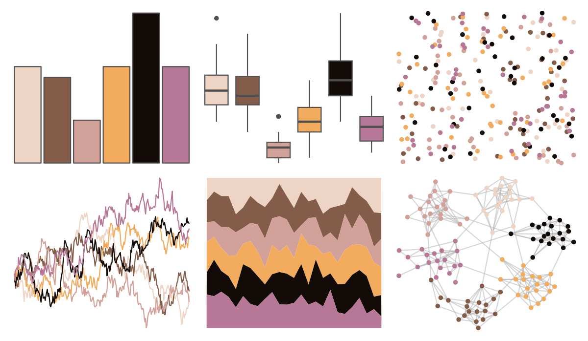

# colRoz - picta 

::: columns
::: {.column width="50%"}

**Github**

[jacintak/colRoz](https://github.com/jacintak/colRoz)
:::

::: {.column width="50%"}

**CRAN**

Not on CRAN
:::
:::

<hr> 

Use with [paletteer](https://emilhvitfeldt.github.io/paletteer/) package:

```r
library(paletteer)
paletteer_d("colRoz::picta")
```

Use raw:

```r
c("#EED4C5FF", "#835D4AFF", "#D2A19AFF", "#F3AC5EFF", "#130B08FF", "#B77897FF")
``` 

 

<br>

# Related Palettes

<div class="list" style="display: grid; grid-template-columns: auto auto auto;"> <figure class="figure">
<a href="../../amerika/Dem_Ind_Rep3/"> </a>
</figure> <figure class="figure">
<a href="../../nationalparkcolors/Denali/"> </a>
</figure> <figure class="figure">
<a href="../../ggprism/pearl2/"> </a>
</figure> <figure class="figure">
<a href="../../colRoz/p_cincta/"> </a>
</figure> <figure class="figure">
<a href="../../tvthemes/Jasper/"> </a>
</figure> <figure class="figure">
<a href="../../beyonce/X46/"> </a>
</figure> <figure class="figure">
<a href="../../soilpalettes/alaquod/"> </a>
</figure> <figure class="figure">
<a href="../../peRReo/don/"> </a>
</figure> <figure class="figure">
<a href="../../nord/red_mountain/"> </a>
</figure> <figure class="figure">
<a href="../../poisonfrogs/Olehmanni/"> </a>
</figure> <figure class="figure">
<a href="../../nationalparkcolors/Arches/"> </a>
</figure> <figure class="figure">
<a href="../../beyonce/X12/"> </a>
</figure> 
</div>
