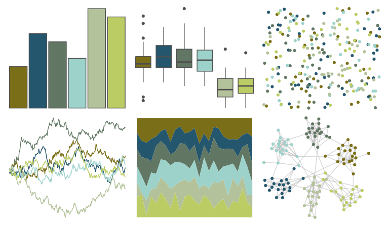

# colRoz - r_aculeatus 

::: columns
::: {.column width="50%"}

**Github**

[jacintak/colRoz](https://github.com/jacintak/colRoz)
:::

::: {.column width="50%"}

**CRAN**

Not on CRAN
:::
:::

<hr> 

Use with [paletteer](https://emilhvitfeldt.github.io/paletteer/) package:

```r
library(paletteer)
paletteer_d("colRoz::r_aculeatus")
```

Use raw:

```r
c("#7B6E18FF", "#24566DFF", "#617764FF", "#9DD2CBFF", "#B3C29AFF", "#BBCC64FF")
``` 

 

<br>

# Related Palettes

<div class="list" style="display: grid; grid-template-columns: auto auto auto;"> <figure class="figure">
<a href="../../awtools/a_palette/"> </a>
</figure> <figure class="figure">
<a href="../../lisa/ClaudeMonet_2/"> </a>
</figure> <figure class="figure">
<a href="../../calecopal/sierra2/"> </a>
</figure> <figure class="figure">
<a href="../../PNWColors/Cascades/"> </a>
</figure> <figure class="figure">
<a href="../../ochRe/jumping_frog/"> </a>
</figure> <figure class="figure">
<a href="../../calecopal/bigsur2/"> </a>
</figure> <figure class="figure">
<a href="../../lisa/WassilyKandinsky/"> </a>
</figure> <figure class="figure">
<a href="../../NatParksPalettes/IguazuFalls/"> </a>
</figure> <figure class="figure">
<a href="../../ggprism/starry2/"> </a>
</figure> <figure class="figure">
<a href="../../impressionist.colors/korenveld_onder_onweerslucht/"> </a>
</figure> <figure class="figure">
<a href="../../NatParksPalettes/SouthDowns/"> </a>
</figure> <figure class="figure">
<a href="../../nationalparkcolors/Yosemite/"> </a>
</figure> 
</div>
